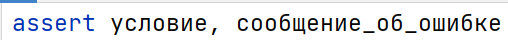
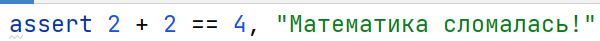
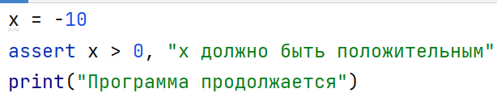
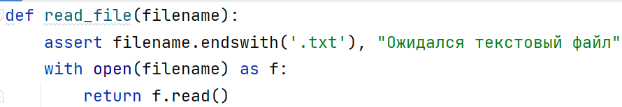
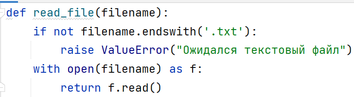
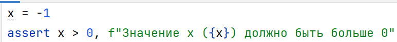
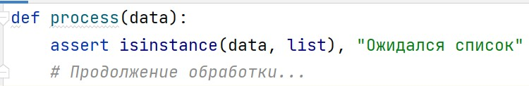
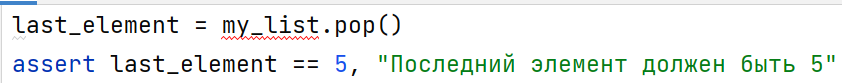

# Команда `assert`

> Источник: «СПРАВОЧНЫЕ МАТЕРИАЛЫ ПО PYTHON», страницы 524–526.

Модуль 7.
КОМАНДА ASSERT

      Команда assert в Python предназначена для проверки условий в коде
во время его выполнения. Если условие не выполняется, выбрасывается
исключение AssertionError. Это удобный способ убедиться, что код
работает так, как задумано, особенно на этапе разработки и тестирования.
Основные моменты использования assert:
   1. Синтаксис: assert — это выражение, состоящее из двух частей:
         ○ условие, которое должно быть истинным (или True),
         ○ и (необязательный) аргумент — сообщение об ошибке.
   2. Общий синтаксис:

Пример:

     Если условие истинно (например, 2 + 2 == 4), ничего не происходит,
программа продолжается.
     Если условие ложно (например, 2 + 2 == 5), программа прерывается с
исключением AssertionError:
Вывод: AssertionError: Математика сломалась!
1. Назначение assert — отладка.
      Основная цель assert — это отладка программы. В ходе разработки
программы часто возникает необходимость проверять корректность
промежуточных данных или подтверждать выполнение ожидаемых
условий. Это помогает обнаружить и исправить ошибки на раннем этапе.
      Однако, assert не должен заменять полноценную обработку ошибок
или валидацию данных, поступающих извне.
2. Выключение assert в режиме оптимизации.
      Когда Python запускается с флагом оптимизации -O (например, через
командную строку python -O script.py), все утверждения assert
игнорируются и не выполняются. Это повышает производительность, так
как исключаются лишние проверки, но может привести к пропуску ошибок
в логике программы.
Пример:
python -O script.py

      В этом случае любой вызов assert в коде будет проигнорирован. При
запуске с флагом -O, программа продолжит выполнение даже с x = -10, и
исключение не будет выброшено.
3. Не для проверки внешних данных.

Поскольку assert может быть отключен, его не следует использовать
для проверки пользовательского ввода или данных, поступающих из
внешних источников (например, файлов, API-запросов). Для таких задач
следует применять конструкции if с явной обработкой ошибок, так как это
более надежно.
Неправильное использование:

     Если этот код будет запущен с флагом -O, проверка формата файла не
произойдет, что может привести к проблемам в дальнейшем.
Правильное использование:

4. Сообщения об ошибке.
      Сообщение об ошибке в assert может быть любым выражением,
которое добавляет контекст к исключению. Это сообщение помогает
разработчику понять, что именно пошло не так. Например, вы можете
включить текущее состояние переменной в сообщение об ошибке для
лучшего понимания проблемы.
Пример:

5. Работа с любыми выражениями.
     Условие в assert может быть любым логическим выражением,
включая вызовы функций, проверки типов и сложные условия.
Пример с проверкой типа данных:

6. Оптимизация производительности.
     Поскольку assert может быть отключен, необходимо убедиться, что
выражение в нем не изменяет состояние программы. Иначе при запуске с
оптимизацией поведение программы может измениться.
Плохой пример:

     Если assert отключен, метод pop() не вызовется, что нарушит логику
программы.

Хороший пример:

     Команда assert в Python — это мощный инструмент для отладки,
позволяющий проверять, что определённые условия выполняются в
программе. Однако его использование имеет свои ограничения. Важно
помнить, что:
   ● assert предназначен для отладки и самотестирования;
   ● его не следует использовать для проверки данных из внешних
     источников;
   ● при использовании в продакшене assert может быть отключён, что
     нужно учитывать при проектировании архитектуры программ.

## Примеры и иллюстрации из исходника

