# Объект `None`

> Источник: «СПРАВОЧНЫЕ МАТЕРИАЛЫ ПО PYTHON», страницы 527–530.

ОБЪЕКТ NONE

       В Python объект None является специальным значением, которое
используется для обозначения "ничего" или "отсутствия значения". Он
играет важную роль в языке, и понимание того, как и где его использовать,
помогает избежать многих ошибок.
       None является экземпляром класса NoneType. Это единственный
объект такого типа в Python. Можно проверить его тип с помощью функции
type().
Пример:

      None часто используется как значение по умолчанию для переменных
и аргументов функций, если ожидается, что значение будет установлено
позже или вовсе может быть пропущено.
Пример:

     Функция, которая не возвращает значение явно с помощью return, по
умолчанию возвращает None.
Пример:

     Возврат None как маркер ошибки. Иногда разработчики используют
None как способ указать, что функция не смогла корректно выполнить
операцию или найти результат.
Пример:

None часто используется для инициализации переменных, которые
будут изменены позже, но не могут быть установлены сразу.
Пример:

     Для проверки того, является ли переменная None, используется
оператор is, так как None — это один единственный объект. Сравнение с ==
работает, но менее предпочтительно, так как is проверяет на идентичность
объекта.
Пример:

      Проверка с == работает, но может быть менее понятна для других
разработчиков.
      Объект None рассматривается как ложный в логических операциях.
Это означает, что его можно использовать в условиях, где нужно проверить
наличие значения:
Пример:

     Иногда None используется в качестве значения по умолчанию для
аргументов функций, особенно когда требуется инициализировать
сложные типы данных, такие как списки или словари.
Пример №1:

Если бы значение по умолчанию было lst=[], все вызовы функции
использовали бы один и тот же изменяемый объект
Пример №2:

     None в Python является синглтоном, что значит, что в программе
существует только один экземпляр этого объекта. Все ссылки на None
ссылаются на один и тот же объект.
     Иногда при работе с возвращаемыми значениями забывают
проверить, что функция вернула None, что приводит к ошибкам.
Пример:

     Чтобы избежать таких ошибок, всегда проверяйте, что значение не
равно None, прежде чем пытаться использовать его.
Пример:

      В случаях, когда требуется указать отсутствие данных в коллекции,
часто используют None.
Пример:

В сложных функциях или при работе с декораторами None может
выступать в роли сигнала о том, что действие не было выполнено или
значение не было передано.
      None — это не просто "пустое" значение. Его использование
охватывает широкий спектр сценариев, начиная от работы с функциями и
заканчивая сложными логическими конструкциями. Правильное
понимание того, как использовать None, помогает писать более безопасный
и предсказуемый код.

## Примеры и иллюстрации из исходника

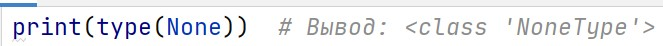

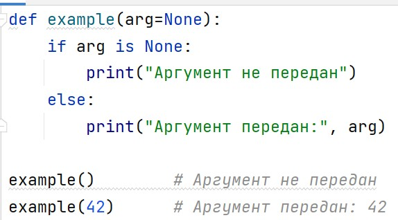

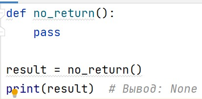

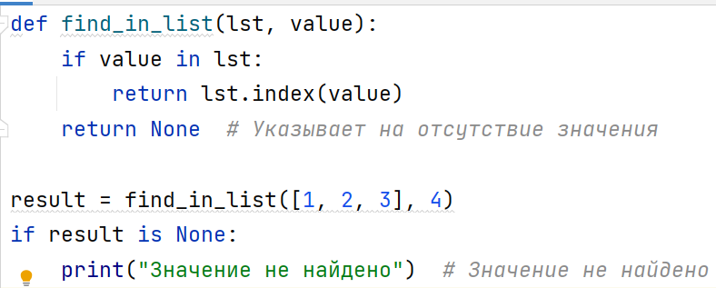

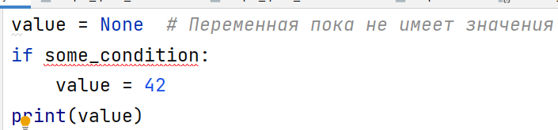

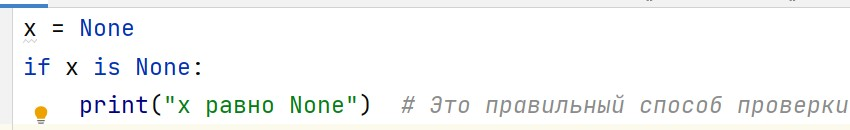

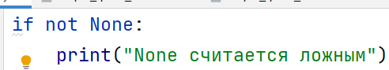

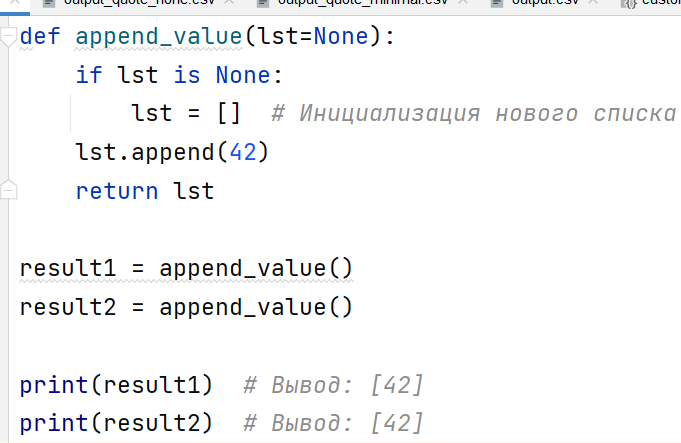

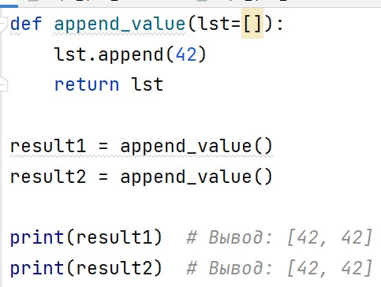

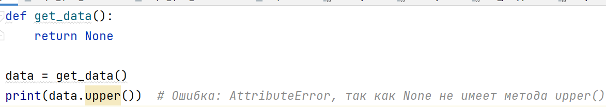

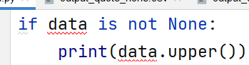

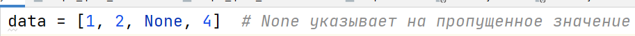
