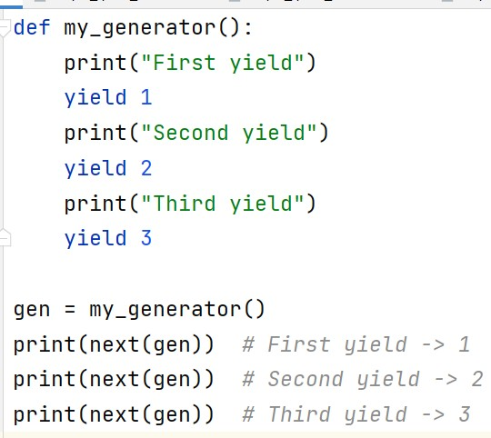
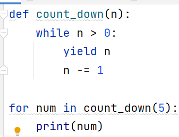
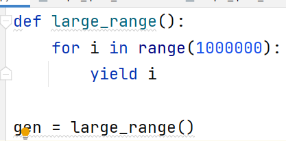

# `yield` и генераторы: основы

> Источник: «СПРАВОЧНЫЕ МАТЕРИАЛЫ ПО PYTHON», страницы 531–532.

YIELD И ГЕНЕРАТОРЫ

      Генераторы — это итераторы, которые генерируют значения на
лету, по мере необходимости, а не сразу создают весь набор данных в
памяти. В Python генераторы создаются с помощью функции, содержащей
ключевое слово yield, или с помощью генераторных выражений
(похожих на списковые включения).
      Генераторная функция похожа на обычную функцию, но вместо
использования return для возврата значения, она использует yield.
   ● Обычная функция использует return, чтобы вернуть значение и
      завершить свою работу. После этого вызов функции больше не
      продолжается.
   ● Генераторная функция использует yield, что позволяет ей возвращать
      значение, но сохранять своё состояние и продолжать работу с того
      места, на котором остановилась, при следующем вызове.
      Каждый раз, когда генератор возвращает значение через yield, его
выполнение приостанавливается, а состояние функции сохраняется, что
позволяет продолжить выполнение позже с того же места.
Пример генераторной функции:

      Здесь генераторная функция приостанавливается каждый раз, когда
достигает yield, и продолжает выполнение с этой точки при следующем
вызове next().
      Когда вы вызываете генераторную функцию, она не выполняется
сразу. Вместо этого она возвращает генераторный объект, который можно
использовать для итерации. Выполнение функции начинается только при
вызове метода next() для этого генераторного объекта.
      Каждый раз, когда вызывается next():
   ● Выполнение продолжается до следующего выражения yield.
   ● Выражение yield возвращает значение и приостанавливает
      выполнение.
   ● Состояние функции сохраняется до следующего вызова next().

Пример:

      В данном примере генератор возвращает числа по одному, начиная с
5 и заканчивая 1, при каждом вызове next().
Преимущества использования генераторов
1. Экономия памяти
      Один из главных плюсов генераторов — это экономия памяти. В
отличие от создания целого списка значений сразу, генераторы создают
элементы только тогда, когда они нужны. Это особенно полезно при работе
с большими или потенциально бесконечными последовательностями.
Пример:

      В этом примере генераторная функция создает последовательность
из миллиона чисел. Однако, в отличие от создания списка, она не занимает
много памяти, так как каждый элемент создается только по мере
необходимости.
2. Ленивое вычисление
      Генераторы вычисляют значения "лениво", то есть только тогда,
когда они запрашиваются. Это делает их особенно полезными при работе с
большими потоками данных или при необходимости задержать
выполнение.
Пример:

## Примеры и иллюстрации из исходника

