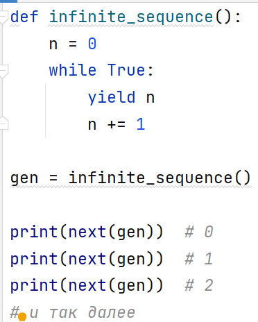
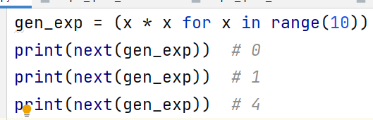
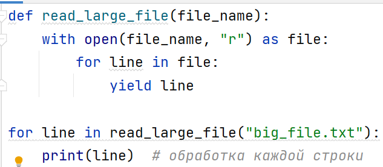
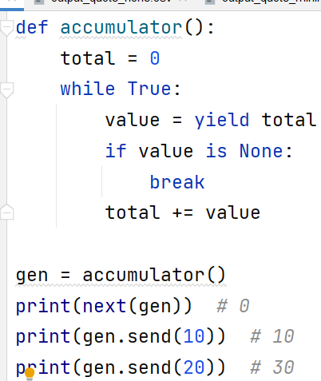
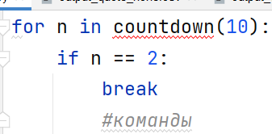
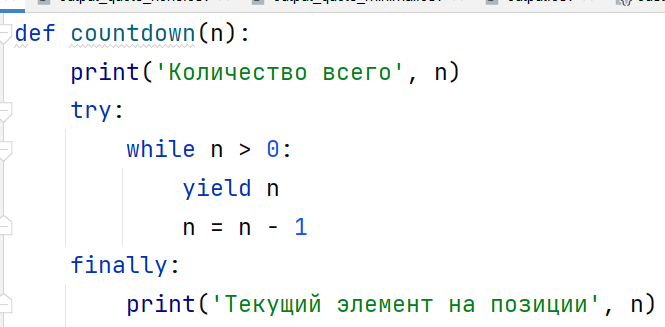
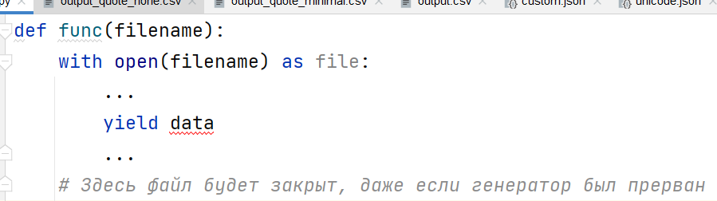

# Генераторы: выражения, `send()`, ленивость и корректное завершение

> Источник: «СПРАВОЧНЫЕ МАТЕРИАЛЫ ПО PYTHON», страницы 533–535 · часть 1.

3. Удобство чтения кода
      Генераторы позволяют писать код, который более прост и легко
читаем, особенно в случаях, когда вам нужно обрабатывать большие
потоки данных по одному элементу.
      Генераторные выражения — это ещё один способ создания
генераторов. Они похожи на списковые включения, но вместо создания
списка создают генератор.
Пример генераторного выражения:

      В этом примере gen_exp создает квадрат каждого числа от 0 до 9, но
не хранит их в памяти, а генерирует их по мере необходимости.
      Рассмотрим пример, когда генераторы особенно полезны — чтение
файла построчно.
Пример:

      В этом примере строки файла не загружаются в память все сразу.
Вместо этого они читаются по одной строке, что позволяет эффективно
обрабатывать даже очень большие файлы.
      Вы можете не только получать значения из генератора через next(), но
и передавать значения обратно в генератор с помощью метода send().
Пример:

Здесь мы можем передавать значения в генератор с помощью send(),
и эти значения влияют на вычисления внутри генератора.
      Генераторы и yield — это мощные средства в Python, которые делают
код более эффективным и экономичным по памяти. Они помогают
работать с большими данными и позволяют создавать последовательности
данных на лету, не загружая всю информацию в память.
      Генераторы удобны в случаях, когда необходимо обрабатывать
данные по частям, и являются важной частью Python для решения задач,
связанных с производительностью и памятью.
      С генераторами связан еще один нюанс, проявляющийся при
частичном потреблении функции-генератора. Рассмотрим следующий
код с преждевременным выходом из цикла:

       Здесь цикл for прерывается вызовом break и связанный с ним
генератор никогда не отрабатывает до завершения. Чтобы функция-
генератор выполнила некоторые завершающие действия, используйте try-
finally или менеджер контекста:

     Генераторы гарантированно выполняют код блока finally, даже если
они не были потреблены полностью. Блок будет выполнен, когда
прерванный генератор уничтожается сборщиком мусора.

Точно так же гарантируется выполнение любого завершающего кода
с участием менеджера контекста:

---

## Примеры и иллюстрации из исходника

