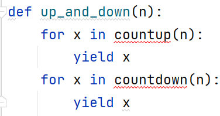
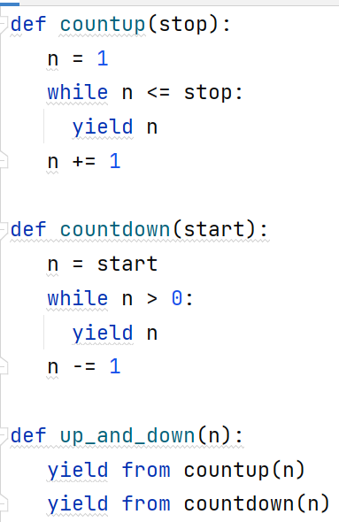
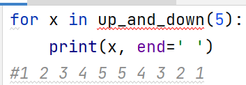

# Делегирование генераторов: `yield from`

> Источник: «СПРАВОЧНЫЕ МАТЕРИАЛЫ ПО PYTHON», страницы 535–536.

---
        делегирование
        Неотъемлемое свойство генераторов в том, что функция с yield
никогда не выполняется сама по себе. Ею всегда должен управлять другой
код с циклом for или явными вызовами next(). Это усложняет написание
библиотечных функций с yield, ведь вызова функции-генератора
недостаточно для обеспечения ее выполнения. Решить эту проблему можно
с помощью команды yield from:
Пример:

    yield from делегирует процесс перебора внешней конструкции.
Можно написать следующий код для управления перебором:

     yield from избавляет от необходимости управлять перебором
вручную. Иначе пришлось бы записать up_and_down(n) так:

## Примеры и иллюстрации из исходника

