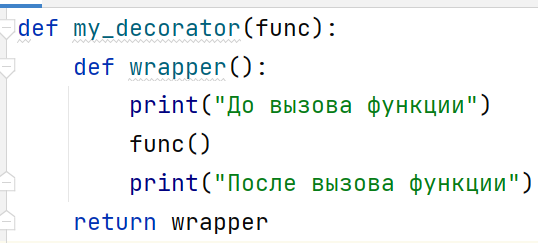

# Декораторы: введение

> Источник: «СПРАВОЧНЫЕ МАТЕРИАЛЫ ПО PYTHON», страницы 537.

ДЕКОРАТОРЫ

        Декораторы — это инструмент в Python, позволяющий изменять
поведение функций или методов без изменения их кода. Декораторы
часто используются для таких задач, как логирование, проверка прав
доступа, кэширование результатов или модификация аргументов и
возвращаемых значений.
        В Python функции являются объектами первого класса, что означает,
что они могут передаваться как аргументы, возвращаться из других
функций и присваиваться переменным.
        Декоратор — это функция, которая принимает другую функцию и
возвращает новую функцию, обычно изменённую или расширенную.
Благодаря этому, можно добавлять функциональность к существующим
функциям без изменения их внутренней структуры.
---
                                 ЭЛЕМЕНТ ТЕОРИИ
        Декораторы часто используются для оборачивания кода в другую
функцию, что позволяет добавлять дополнительные действия до или после
выполнения обернутой функции.
        Обертывание функции – это процесс создания новой функции,
которая добавляет некоторую функциональность к существующей
функции без изменения её исходного кода. Это часто делается с помощью
декораторов. Например, если вам нужно добавить логирование, измерение
времени выполнения или управление доступом к функции, вы можете
создать декоратор, который "обернет" исходную функцию дополнительной
логикой.
---
        Декоратор — это функция, которая принимает другую функцию как
аргумент и возвращает функцию-обертку.
Пример простого декоратора:

## Примеры и иллюстрации из исходника

