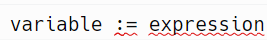
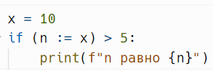
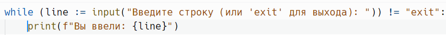
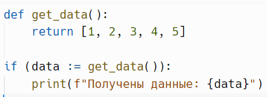

# Моржовое присваивание `:=`

> Источник: «СПРАВОЧНЫЕ МАТЕРИАЛЫ ПО PYTHON», страницы 400.

МОРЖОВОЕ ПРИСВАИВАНИЕ

      Моржовое присваивание (или "walrus operator", :=) было введено в
Python 3.8 и позволяет одновременно присваивать значение переменной и
возвращать это значение в выражении. Это может быть особенно полезно в
ситуациях, когда нужно использовать результат вычисления сразу после
его получения.
Синтаксис:

     variable — имя переменной, в которую будет присвоено значение.
     expression — любое выражение, результат которого будет присвоен
переменной.
Пример №1:
     Моржовое присваивание используется в условных операторах:

     Значение 10 присваивается n. Условие n > 5 проверяется сразу после
присваивания.
Пример №2:
      Моржовое присваивание удобно использовать в циклах, особенно
когда нужно читать данные, например, из ввода.

       На каждой итерации переменной line присваивается результат
input(). Цикл продолжается, пока пользователь не введет "exit".
Пример №3:
      Моржовое присваивание полезно, когда необходимо сохранить
результат выполнения функции.

     Если get_data() возвращает непустой список, он будет присвоен
переменной data, и строка будет выведена.

## Примеры и иллюстрации из исходника

