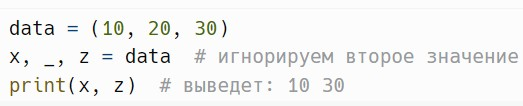
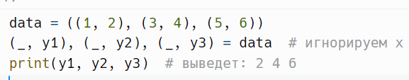
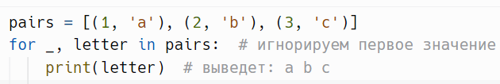
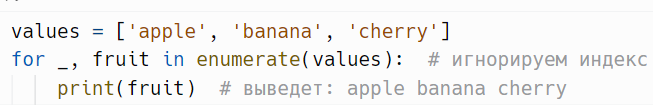
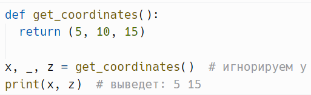
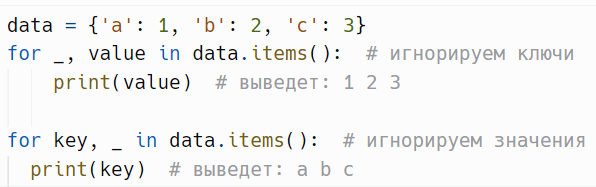
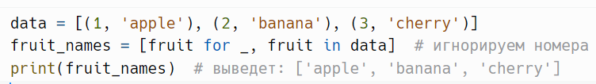
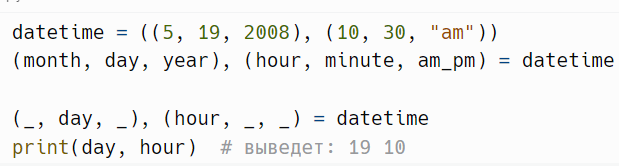

# Игнорируемые значения `_`

> Источник: «СПРАВОЧНЫЕ МАТЕРИАЛЫ ПО PYTHON», страницы 401–403.

ИГНОРИРУЕМЫЕ ЗНАЧЕНИЯ

      Игнорируемые значения в Python обычно обозначаются символом
подчеркивания (_). Это соглашение используется для указания того, что
определенные значения не нужны, что делает код более читабельным и
понятным.
Причины использования игнорируемых значений:
   1. Читаемость: Явно указывая, что некоторые значения игнорируются,
      вы делаете код более понятным для других разработчиков.
   2. Сокращение: Позволяет избегать создания множества переменных
      для значений, которые не будут использоваться.
   3. Минимизация ошибок: Уменьшает вероятность случайного
      использования игнорируемых значений.
      При распаковке кортежей или списков можно использовать _, чтобы
обозначить, что определенные значения не важны.
Пример:

     При распаковке вложенных кортежей или списков _ можно
использовать для игнорирования внутренних значений.
Пример:

     При итерации по коллекциям        можно    использовать   _   для
игнорирования ненужных значений.
Пример:

     Если вам нужно перебирать значения с индексами, вы можете
игнорировать индекс.
Пример:

     При возвращении нескольких значений из функции, вы можете
игнорировать ненужные.
Пример:

При итерации по словарям можно использовать _, чтобы
игнорировать ключи или значения.
Пример:

     При создании списков с помощью генераторов вы можете
использовать _.
Пример:

Пример:

     Использование игнорируемых значений в Python позволяет писать
более чистый и понятный код. Это помогает вам сосредоточиться на
важных данных и избегать путаницы с ненужными значениями. Также
стоит отметить, что использование _ — это не только практика, но и
соглашение, которое улучшает читаемость кода и упрощает его понимание.
     Следует помнить, что хотя _ является стандартной практикой, его
использование должно быть обоснованным. Если значения потенциально
могут быть важны в будущем, возможно, стоит задуматься о том, как их
сохранить для дальнейшего использования.

## Примеры и иллюстрации из исходника

