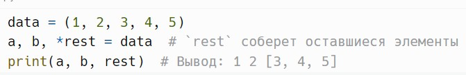
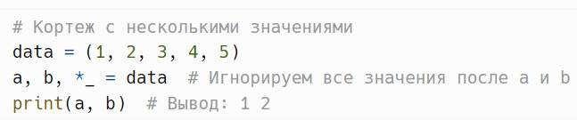
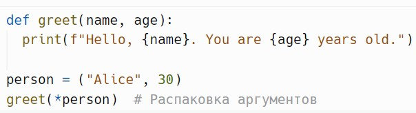
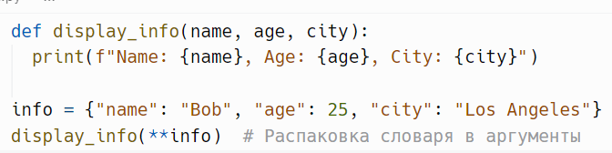
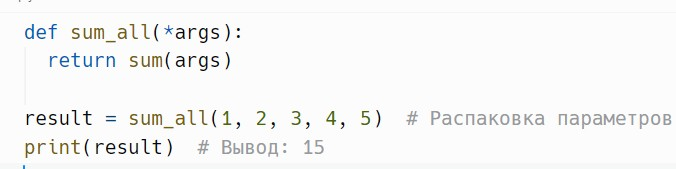
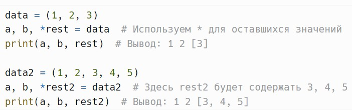

# Распаковка

> Источник: «СПРАВОЧНЫЕ МАТЕРИАЛЫ ПО PYTHON», страницы 404–405.

РАСПАКОВКА

     Распаковка — это процесс извлечения значений из коллекций
(например, списков, кортежей) и присваивания их переменным.
Пример:

     Здесь переменные a и b принимают первые два значения, а rest
собирает оставшиеся в список.
     Кроме того, Вы можете игнорировать определенные значения,
используя _.
Пример:

     Также можно распаковывать аргументы при вызове функции.
Пример:

     Распаковка словарей в функции с использованием **.
Пример:

     Распаковка параметров в функции с использованием *args.
Пример:

     Распаковка значений в зависимости от их количества.
Пример:

## Примеры и иллюстрации из исходника

