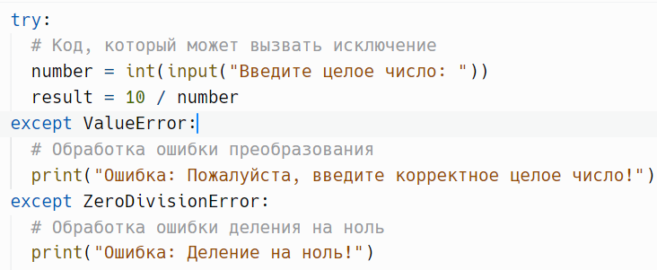
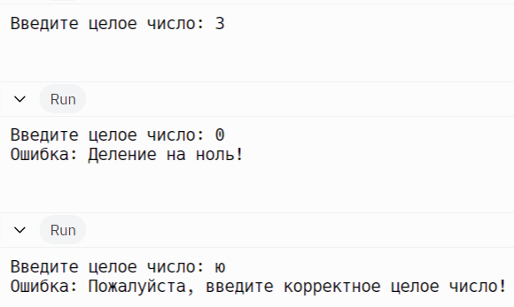
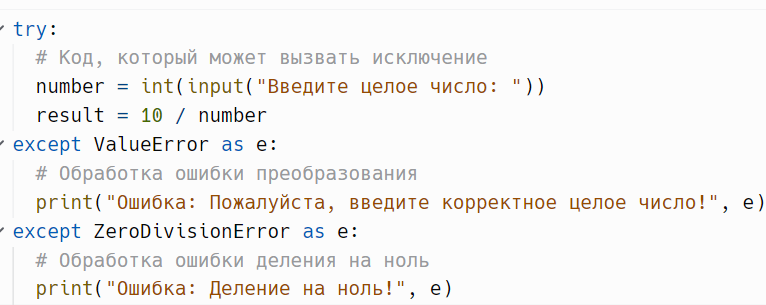
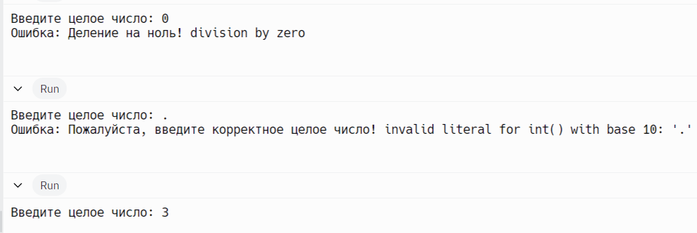
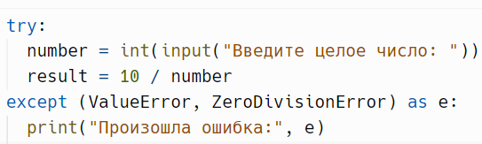
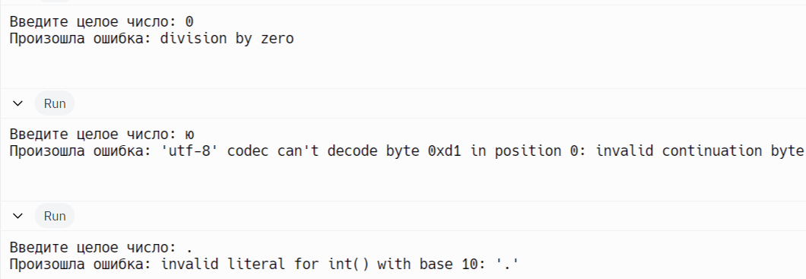
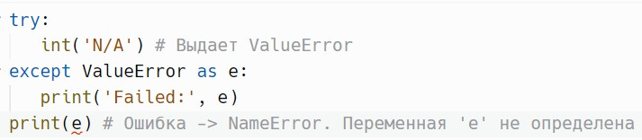
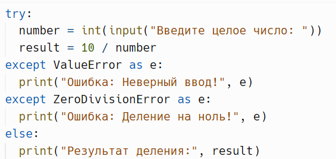
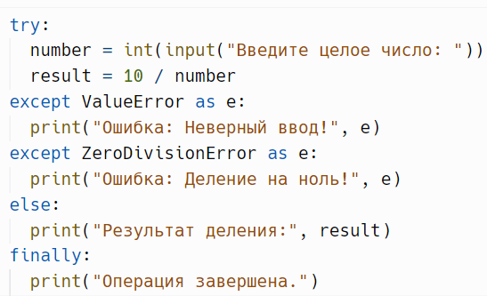
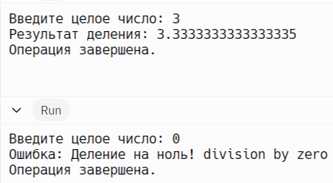

# Исключения: `try`, `except`, `else`, `finally`

> Источник: «СПРАВОЧНЫЕ МАТЕРИАЛЫ ПО PYTHON», страницы 406–417 · часть 1.

ИСКЛЮЧЕНИЯ

      Исключения в Python — это события, которые происходят во время
выполнения программы и указывают на возникновение ошибки. Когда
возникает исключение, программа прерывает нормальный поток
выполнения. Исключения могут возникать по самым разным причинам,
например:
   ● Деление на ноль.
   ● Попытка доступа к элементу, который не существует.
   ● Неверный тип данных.
   ● Ошибка ввода-вывода.
      Основная структура для обработки исключений состоит из блока try,
в который помещается код, потенциально вызывающий исключение, и
блока except, который обрабатывает это исключение.
Пример:

Вывод:

     Вы можете использовать ключевое слово as, чтобы присвоить
исключение переменной, что позволяет вам получить доступ к его
атрибутам и сообщениям.
Пример:

Вывод:

     В этом примере, если пользователь введёт некорректное значение
(например, строку), будет выброшено исключение ValueError. Если
пользователь введёт 0, будет выброшено исключение ZeroDivisionError.
Мы можем обрабатывать каждое из этих исключений отдельно, чтобы
предоставить пользователю информативные сообщения об ошибках.
     Если ваш код может вызывать несколько исключений, вы можете
использовать несколько блоков except или объединить их в один блок.
Пример:

Вывод:

     Переменная для хранения значения исключения доступна только
внутри соответствующего блока except. После того как управление
выходит за пределы блока, она становится неопределенной.
Пример:

Блок else выполняется, если в блоке try не возникло исключений. Это
удобно для кода, который должен выполняться только в случае успешного
завершения операции.
Пример:

     Блок finally выполняется в любом случае, даже если в блоке try
произошло исключение. Это полезно для освобождения ресурсов,
например, для закрытия соединений или очистки данных.
Пример:

Вывод:

---
        Команда raise используется для генерации (или «возбуждения»)
исключения вручную в коде. Это позволяет разработчику сигнализировать
о возникновении ошибки или необычной ситуации. Например, вы можете
использовать raise, чтобы сообщить, что что-то пошло не так, или чтобы
указать на неправильные параметры функции.

## Примеры и иллюстрации из исходника

