# `raise`, распространение и цепочки исключений

> Источник: «СПРАВОЧНЫЕ МАТЕРИАЛЫ ПО PYTHON», страницы 406–417 · часть 2.

Общий синтаксис команды raise выглядит следующим образом:
Синтаксис:

      ExceptionType — это тип исключения (например, ValueError,
TypeError и т.д.).
      Сообщение об ошибке — это строка, содержащая информацию о том,
что произошло не так (необязательный параметр).
      Давайте рассмотрим пример, в котором мы используем raise для
выбрасывания стандартного исключения.
Пример:

Вывод:

      В этом примере функция divide проверяет, равен ли делитель нулю, и
если это так, выбрасывает исключение ZeroDivisionError с сообщением.
Блок try перехватывает это исключение и выводит сообщение об ошибке.
Пример:

Вывод:

Функция divide:

Выполняет деление двух чисел. Если b равен нулю, выбрасывается
исключение ZeroDivisionError.
Функция process_division:
   ● Внутри блока try происходит попытка выполнить деление.
   ● Если возникает ZeroDivisionError, мы обрабатываем его, выводим
     сообщение и затем вызываем raise, чтобы повторно выбросить это
     же исключение.
   ● Если возникает TypeError (например, если переданы строки вместо
     чисел), мы также обрабатываем его аналогично и повторно
     выбрасываем.
Основной код:
   ● Вызов process_division(10, 0) приводит к выбрасыванию
     ZeroDivisionError.
   ● Этот блок except ловит это исключение и выводит сообщение.
     Вы также можете использовать raise в условиях, чтобы выбрасывать
исключения в зависимости от логики вашей программы.
Пример:

---
ПОДРОБНЫЙ РАЗБОР
        Рассмотрим, как интерпретатор обрабатывает исключения, как
происходит управление при возникновении исключений, а также какие
действия выполняются после обработки исключения.
        Когда в программе возникает ошибка, интерпретатор Python
выполняет следующие шаги:
1. Выброс исключения:
    ● Если возникает ошибка во время выполнения кода внутри блока try,
        интерпретатор выбрасывает (или возбуждает) исключение. Этот
        процесс останавливает выполнение всех оставшихся строк кода в
        этом блоке.
2. Поиск обработчика исключений:
    ● Интерпретатор начинает искать подходящий блок except, который
        может обработать возникшее исключение.
    ● Он просматривает все блоки except, ассоциированные с текущим
        блоком try, в порядке их появления.
3. Обработка исключения:

● Если подходящий блок except найден, управление передается этому
      блоку, и он выполняется.
   ● В блоке except вы можете обработать исключение, например,
      вывести сообщение об ошибке, записать информацию в лог или
      предпринять другие действия для обработки ситуации.
4. Возврат к основному коду:
   ● После выполнения блока except управление возвращается к первой
      строке кода, следующей после блока try-except.
   ● Это позволяет программе продолжить выполнение, как если бы
      ничего не произошло (если это возможно и не было выброшено
      новое исключение).
5. Если обработчика нет:
   ● Если подходящий блок except не найден, программа завершает
      выполнение с сообщением об ошибке.
Пример:

Вывод:

Вызов функции main:
  ● При запуске функции main управление переходит к блоку try.
Попытка деления:
  ● Программа пытается выполнить divide(10, 0).
  ● Внутри функции divide возникает исключение ZeroDivisionError, и
     выполнение прекращается на этом этапе.
Поиск обработчика:
  ● Интерпретатор ищет блок except, который может обработать
     ZeroDivisionError.
  ● Найден блок except ZeroDivisionError, который выполняется.
Обработка исключения:

● В блоке except выводится сообщение об ошибке, и программа
     продолжает выполнение.
Возврат к основному коду:
  ● После завершения блока except выполнение продолжается с первой
     строки после блока try-except, где выводится сообщение о
     продолжении выполнения.
Важные моменты:
   ● Как только возникает исключение, все строки кода в блоке try после
     места возникновения исключения не выполняются.
   ● Вы можете иметь вложенные блоки try-except. Если возникнет
     исключение в одном блоке, программа сначала проверит, есть ли
     соответствующий обработчик в текущем блоке, и затем будет
     проверять вложенные блоки.
   ● Вы можете обрабатывать разные типы исключений с помощью
     нескольких блоков except. Если несколько блоков соответствуют
     типу исключения, выполнится только первый найденный.
Пример:

Вывод:

---
        Когда в блоке try возникает исключение, Python начинает поиск
подходящего блока except, который сможет обработать это исключение.
Если подходящий блок не найден, исключение продолжает
«распространяться» вверх по стеку вызовов. Это означает, что Python будет

искать обработчик исключения в вышестоящих функциях и блоках try-
except, пока не найдёт подходящий блок или не достигнет верхнего уровня
программы.
      Когда исключение поднимается до верхнего уровня программы без
перехвата, интерпретатор прерывает выполнение программы сообщением
об ошибке.
      Рассмотрим пример, где исключение передается от одной функции к
другой.
Пример:

        Функция divide(a, b): Выполняет деление. Если b равен нулю,
возникает ZeroDivisionError.
Функция main():
    ● Содержит блок try, который пытается вызвать функцию divide с
        аргументами, приводящими к ZeroDivisionError.
    ● Найденный блок except обрабатывает ZeroDivisionError и выводит
        сообщение.
Внешний блок try-except:
    ● Внешний блок не перехватывает исключение, так как оно
        обрабатывается внутри функции main.
    ● Если бы в main() не было соответствующего блока except,
        исключение распространилось бы вверх до внешнего блока, где
        было бы также поймано.
---
        Когда возникает исключение в Python, оно создает объект, который
содержит различные атрибуты.
e.args:
    ● Это кортеж, содержащий аргументы, переданные конструктору
        исключения.
    ● В большинстве случаев он содержит только строку с описанием
        ошибки, но для некоторых исключений, таких как OSError, он
        может содержать больше информации.
Пример:

e.__cause__:
   ● Этот атрибут указывает на предыдущее исключение, если текущее
      исключение было вызвано в ответ на другое исключение.
   ● Это полезно для отслеживания цепочки исключений, когда одно
      исключение вызывает другое.
Пример:

      Использование конструкции from в операторе raise позволяет
установить связь между текущим исключением и предшествующим
исключением. Это делается для того, чтобы сохранить контекст ошибки,
что облегчает диагностику и отладку.
      Когда вы вызываете raise с конструкцией from, вы создаете цепочку
исключений. Это значит, что новое исключение (в данном случае
RuntimeError) будет связано с исходным исключением (ValueError).
      Это позволяет вам видеть, что одно исключение возникло в
результате другого, и это очень полезно для понимания проблемы.
      Когда вы обрабатываете исключение и выбрасываете новое,
использование from позволяет передать информацию о первоначальной
ошибке. Это помогает разработчику понять, что именно произошло и
почему возникло новое исключение.
      Использование from в конструкции raise позволяет установить связь
между исключениями, что делает обработку ошибок более информативной
и удобной для отладки. Это хорошая практика в Python, когда вы
обрабатываете исключения и хотите, чтобы контекст ошибки сохранялся.
e.__context__:

● Этот атрибут указывает на предыдущее исключение, если оно было
    выдано при обработке другого исключения, но не преднамеренно.
  ● Это позволяет отслеживать исключения, возникающие в контексте
    других исключений, но без явного связывания.
Пример:

e.__traceback__:
   ● Этот атрибут содержит объект трассировки стека, который
       указывает на место, где произошло исключение.
   ● Это полезно для отладки, поскольку позволяет получить
       информацию о стеке вызовов на момент возникновения
       исключения.
Пример:

      Вывод будет содержать информацию о трассировке, но может
выглядеть сложным для чтения. Вы можете использовать модуль traceback
для получения более удобного вывода.

## Примеры и иллюстрации из исходника

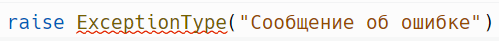

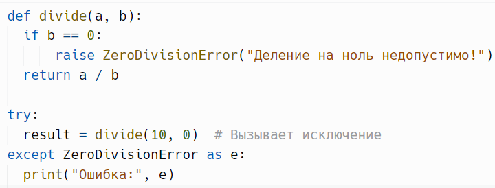

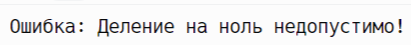

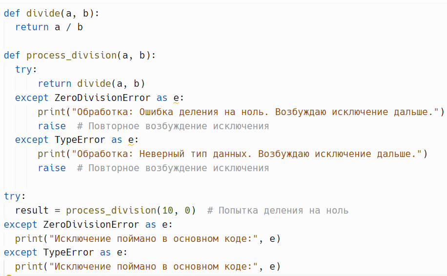

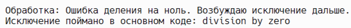

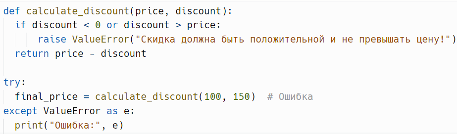

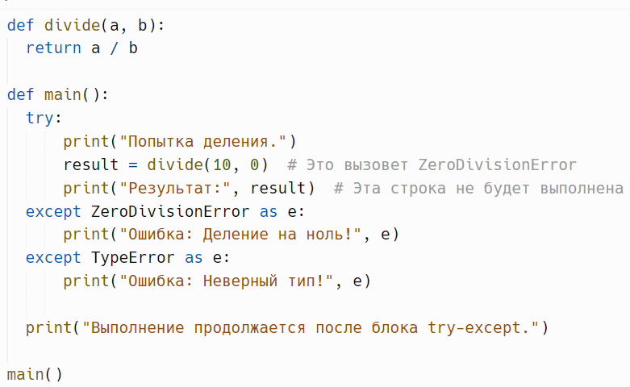

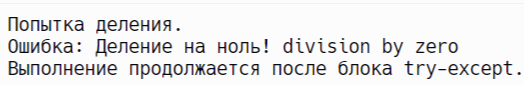

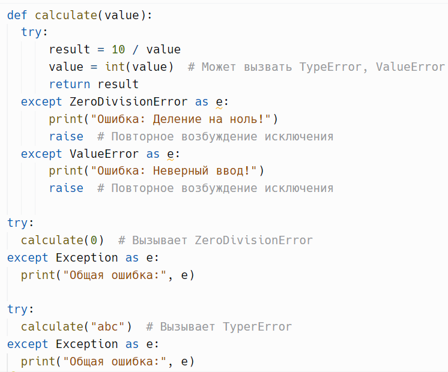

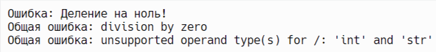

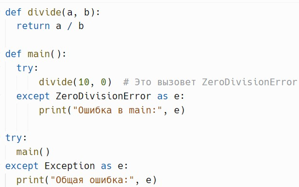

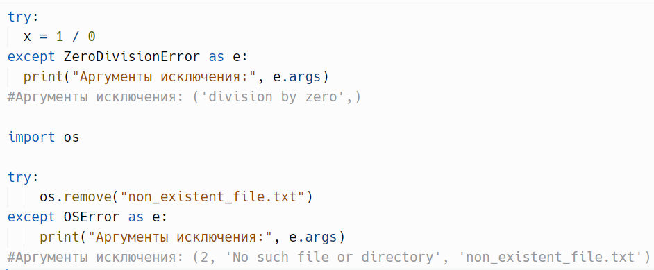

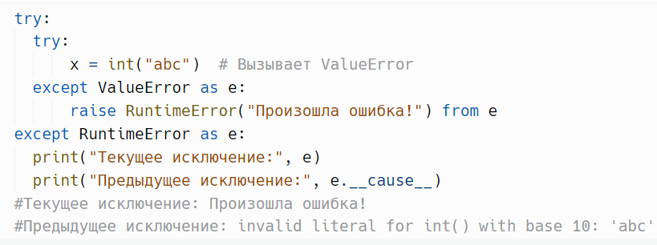

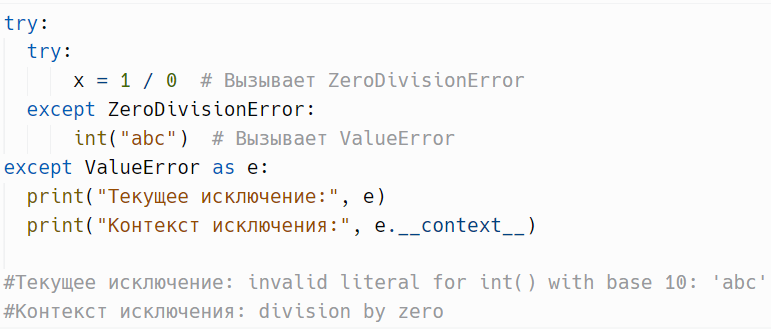

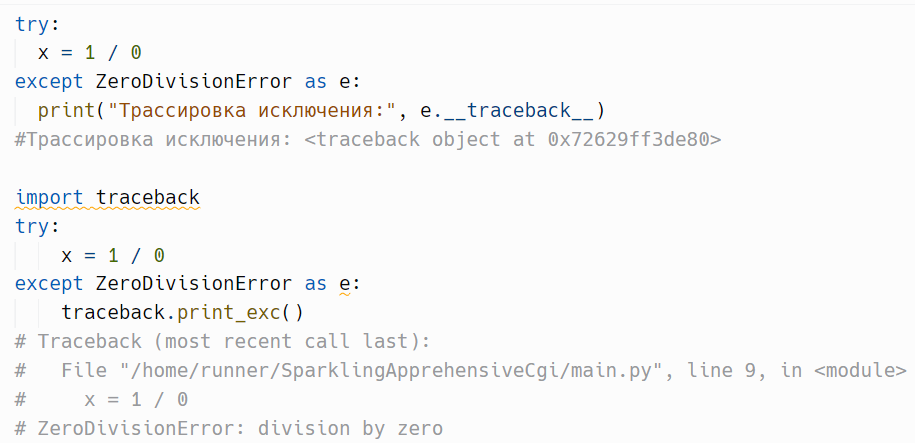
