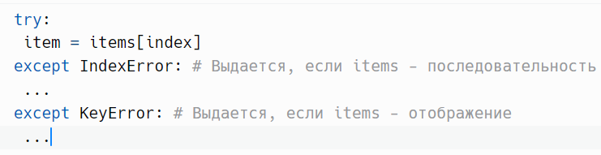
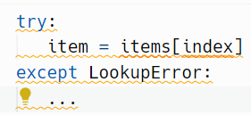
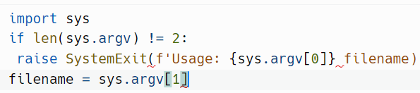
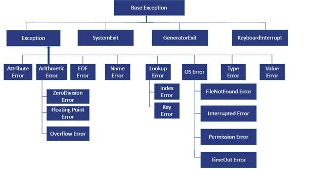

# Иерархия исключений

> Источник: «СПРАВОЧНЫЕ МАТЕРИАЛЫ ПО PYTHON», страницы 418–421.

ИЕРАРХИЯ ИСКЛЮЧЕНИЙ

      Одна из трудностей обработки исключений — множество
исключений, которые теоретически могут возникнуть в вашей программе.
Только встроенных более 60. Добавьте к ним остальные исключения
стандартной библиотеки, и количество возможных вариантов увеличится
до нескольких сотен. Более того, часто нельзя легко заранее определить,
какие исключения могут возникнуть в той или иной части кода.
Исключения не записываются в сигнатуре вызова функции, и компилятор
не может гарантировать правильность обработки исключений в вашем
коде. В результате обработка исключений иногда кажется хаотичной и
непредсказуемой.
      Полезно понимать, что исключения объединяются в иерархию,
основанную на наследовании. Вместо того чтобы ориентироваться на
конкретные ошибки, бывает проще сосредоточиться на более общих их
категориях. Для примера можно взять разные ошибки, возникающие при
получении значений из контейнера.
Пример:

     Чтобы не писать код обработки двух конкретных исключений, проще
поступить так:

      LookupError — класс, представляющий группу исключений на более
высоком уровне. IndexError и KeyError наследуют от LookupError, так что
секция except будет перехватывать оба исключения. Но категория
LookupError не настолько широка, чтобы включать ошибки, не связанные с
выборкой значений.
   1. BaseException - Корневой класс для всех исключений
   2. Exception - Базовый класс для всех ошибок, связанных с
      выполнением программы

3.     ArithmeticError - Базовый класс для ошибок, связанных с
        математическими вычислениями
    4. ImportError - Базовый класс для ошибок, связанных с импортом
    5. LookupError - Базовый класс для ошибок, связанных с выборкой из
        контейнера
    6. OSError - Базовый класс для всех ошибок, связанных с системой.
        OSError и EnvironmentError являются синонимами
    7. ValueError - Базовый класс для ошибок, связанных со значениями,
        включая «Юникод»
    8. UnicodeError - Базовый класс для ошибок, связанных с кодировкой
        строк в «Юникоде»
        Класс BaseException редко используется при обработке исключений.
Он представляет любые возможные исключения. К этой категории
относятся          специализированные               исключения,           влияющие            на
последовательность выполнения программы: SystemExit, KeyboardInterrupt
и StopIteration. Перехватывать их обычно не нужно.
        Вместо этого все нормальные ошибки, относящиеся к программе,
наследуют от Exception.
        Класс ArithmeticError базовый для всех ошибок, связанных с
математическими             вычислениями,           таких       как      ZeroDivisionError,
FloatingPointError и OverflowError.
        Класс ImportError базовый для всех ошибок, связанных с импортом.
        Класс LookupError базовый для всех ошибок, связанных с выборкой
из контейнеров.
        Класс OSError базовый для всех ошибок, порожденных
операционной системой и средой.
        Класс OSError охватывает широкий диапазон исключений,
относящихся к файлам, сетевым подключениям, разрешениям, каналам,
тайм-ауту и т. д.
        Исключение ValueError обычно выдается при передаче операции
некорректного входного значения.
        UnicodeError — субкласс ValueError, объединяющий все ошибки,
связанные с кодированием и декодированием «Юникода».
---
        Ниже представлены часто встречающиеся исключения, которые
наследуются от Exception, но не входят в более крупные группы
исключений.
    1. AssertionError - Неудачная проверка assert
    2. AttributeError - Неудача при поиске атрибута у объекта
    3. EOFError - Конец файла

4. MemoryError - Ошибка нехватки памяти с возможностью
        восстановления
    5. NameError - Имя не найдено в глобальном или локальном
        пространстве имен
    6. NotImplementedError - Нереализованная возможность
    7. RuntimeError - Обобщенная ошибка «Произошло что-то плохое»
    8. TypeError - Операция применяется к объекту неправильного типа
    9. UnboundLocalError - Локальная переменная используется до
        присваивания значения
---
        Обычно исключения резервируются для обработки ошибок. Но
некоторые используются для изменения последовательности выполнения.
Эти исключения, наследуются от BaseException напрямую.
    1. SystemExit Выдается для обозначения выхода из программы
    2. KeyboardInterrupt Выдается при прерывании программы сочетанием
        Ctrl+C
    3. StopIteration Выдается для обозначения завершения перебора
        Исключение SystemExit используется для намеренного завершения
программ. В аргументе передается либо целочисленный код завершения,
либо строковое сообщение. Если передается строка, она выводится в
sys.stderr, после чего программа завершается с кодом 1.
Стандартный пример:

      Исключение KeyboardInterrupt выдается, когда программа получает
сигнал SIGING (обычно нажатием Control+C на терминале). Оно необычно
тем, что происходит асинхронно: может появиться почти в любое время и в
любой команде вашей программы. По умолчанию Python просто завершает
программу, когда это происходит.
      Исключение StopIteration — часть протокола итераций. Оно
сигнализирует о завершении итерации.

## Примеры и иллюстрации из исходника

