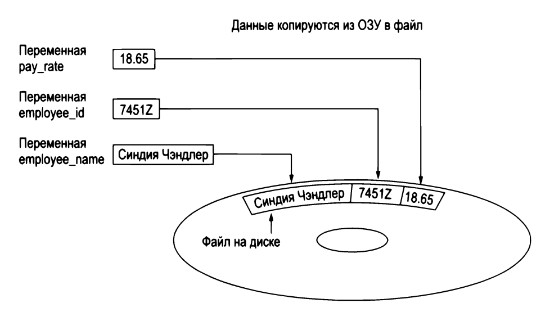
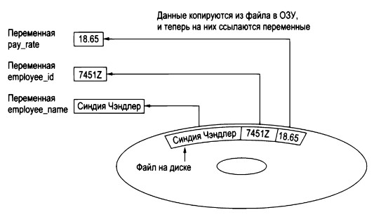
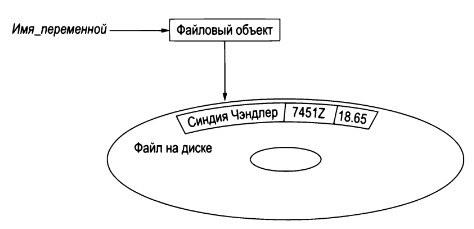

# Файлы: основные понятия и способы доступа

> Источник: «СПРАВОЧНЫЕ МАТЕРИАЛЫ ПО PYTHON», страницы 422–425.

ФАЙЛЫ

      Когда программы работают с данными, важно, чтобы эти данные
могли сохраняться между запусками. В противном случае пользователям
придется вводить всю информацию заново, что может быть не только
неудобно, но и неэффективно. Запись данных в файлы позволяет
программам сохранять состояние и информацию, что улучшает
пользовательский ?.
Типы программ и их работа с файлами
   1. Текстовые процессоры:
        ○ Позволяют пользователям создавать и редактировать
           текстовые документы.
        ○ Сохраняют         документы         в     текстовых     файлах
           (например, .docx, .txt), что дает возможность редактировать и
           распечатывать их позже.
        ○ Поддерживают разные форматы, что позволяет обмениваться
           документами между разными пользователями и платформами.
   2. Графические редакторы:
        ○ Используются для создания и редактирования изображений.
        ○ Сохраняют изображения в различных графических форматах
           (например, .jpg, .png, .gif), что обеспечивает совместимость с
           другими программами и устройствами.
        ○ Позволяют       пользователям       сохранять    изменения    и
           возвращаться к работе над проектом позже.
   3. Электронные таблицы:
        ○ Предназначены для работы с числовыми данными и
           формулами.
        ○ Сохраняют данные в таблицах в файлах (например, .xlsx, .csv),
           что облегчает анализ и обработку информации.
        ○ Позволяют выполнять сложные вычисления и визуализацию
           данных.
   4. Игры:
        ○ Хранят данные о прогрессе игрока, высокие очки и настройки в
           файлах (например, .sav, .json).
        ○ Позволяют сохранять состояние игры, что делает игровой
           процесс более удобным.
        ○ Часто используют файлы для хранения контента, такого как
           текстуры и звуки.
   5. Веб-браузеры:
        ○ Хранят временные файлы и куки для улучшения работы с веб-
           страницами.

○ Куки могут содержать информацию о сеансах, предпочтениях
            пользователей и содержимом корзины покупок.
        ○ Позволяют ускорить загрузку страниц и сохранять личные
            настройки пользователя.
     Программисты обычно называют процесс сохранения данных в
файле как "запись данных" в файл. Когда часть данных пишется в файл, она
копируется из переменной, находящейся в ОЗУ, в файл. Термин "файл
вывода" используется для описания файла, в который данные сохраняются.
Он имеет такое название, потому что программа помещает в него выходные
данные.
Пример:

     Процесс извлечения данных из файла называется чтением данных из
файла. Когда порция данных считывается из файла, она копируется из
файла в ОЗУ, где на нее ссылается переменная. Термин "файл ввода"
используется для описания файла, из которого данные считываются. Он
называется так, потому что программа извлекает входные данные из этого
файла.
Пример:

---
Типы файлов

Существует два типа файлов: текстовые и двоичные. Текстовый файл
содержит данные, которые были закодированы в виде текста при помощи
такой схемы кодирования, как ASCII или Юникод. Даже если файл
содержит числа, эти числа в файле хранятся как набор символов. В
результате файл можно открыть и просмотреть в текстовом редакторе,
таком как Блокнот.
      Двоичный файл содержит данные, которые не были преобразованы в
текст. Данные, которые помещены в двоичный файл, предназначены только
для чтения программой, и значит, такой файл невозможно просмотреть в
текстовом редакторе.
Методы доступа к файлам
        Большинство языков программирования обеспечивает два разных
способа получения доступа к данным, хранящимся в файле:
последовательный доступ и прямой доступ.
        Во время работы с файлом с последовательным доступом происходит
последовательное обращение к данным, начиная с самого начала файла и
до его конца. Если требуется прочитать порцию данных, которая
размещена в конце файла, то придется прочитать все данные, которые идут
перед ней, — проскочить непосредственно к нужным данным не получится.
        Во время работы с файлом с прямым доступом (который также
называется файлом с произвольным доступом) можно непосредственно
перескочить к любой порции данных в файле, не читая данные, которые
идут перед ней. Это подобно тому, как работает проигрыватель компакт-
дисков или МР3З-плеер. Можно прямиком перескочить к любой песне,
которую нужно прослушать.
---
        Для того чтобы программа работала с файлом, находящемся на диске
компьютера, она должна создать в оперативной памяти файловый объект.
        Файловый объект в Python — это объект, который предоставляет
интерфейс для работы с файлами. Он позволяет выполнять операции
чтения, записи, закрытия и управления указателями внутри файлов.
        Файловые объекты создаются с помощью функции open() и являются
основным способом взаимодействия с файлами в Python. В программе на
файловый объект ссылается переменная. Она используется для
осуществления любых операций, которые выполняются с файлом.
Пример:

     Для создания файлового объекта используется функция open(),
которая принимает имя файла и режим доступа.
Графический пример:

## Примеры и иллюстрации из исходника

