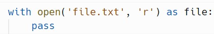
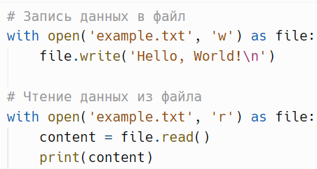
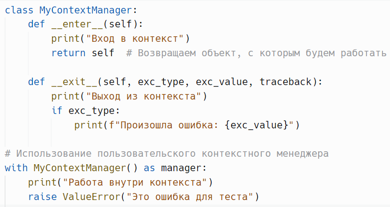
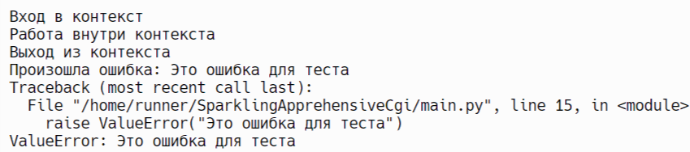
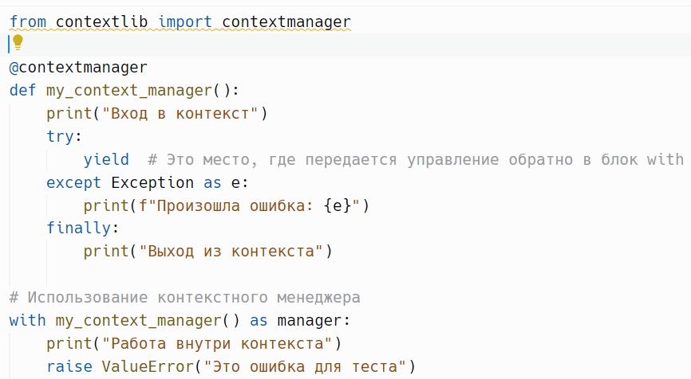
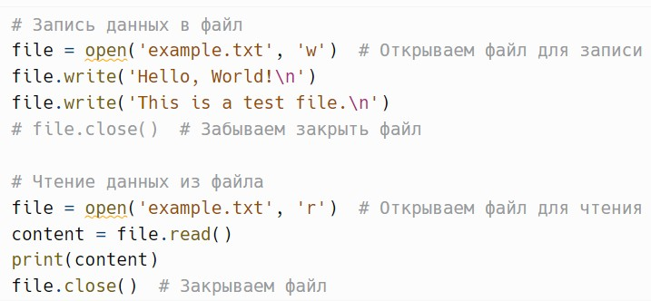
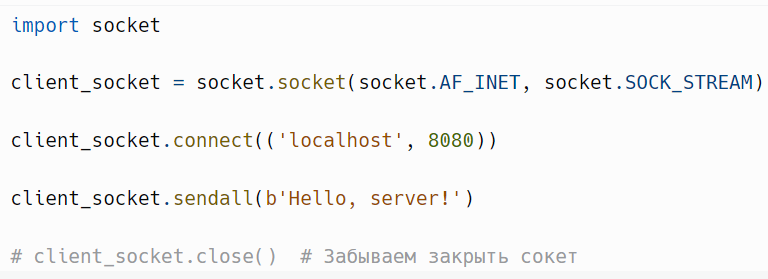
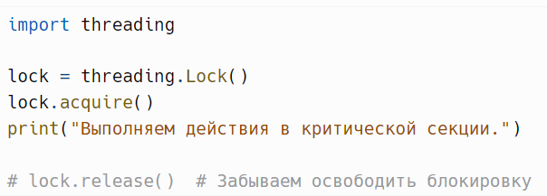
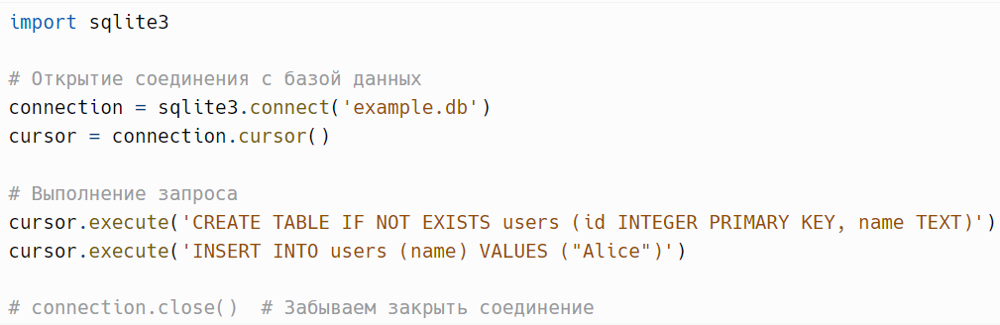

# Контекстный менеджер `with`

> Источник: «СПРАВОЧНЫЕ МАТЕРИАЛЫ ПО PYTHON», страницы 426–430.

КОНТЕКСТНЫЙ МЕНЕДЖЕР WITH

     Контекстный менеджер with в Python — это удобный и безопасный
способ работы с ресурсами, такими как файлы, сокеты и блокировки. Он
упрощает управление ресурсами, автоматически обрабатывая их открытие
и закрытие, а также освобождая ресурсы в случае возникновения
исключений.
Синтаксис использования with:

      Здесь open('file.txt', 'r') создает файловый объект, и как только
выполнение кода в блоке with завершено, файл автоматически закрывается,
даже если в процессе выполнения возникло исключение.
Как работает with
Когда вы используете with, Python вызывает два метода:
   1. __enter__(): Этот метод вызывается при входе в блок with. Он
      выполняет необходимые операции для подготовки ресурса
      (например, открытие файла) и возвращает объект, который будет
      связан с переменной (в данном случае file).
   2. __exit__(type, value, traceback): Этот метод вызывается при выходе из
      блока with. Он отвечает за выполнение операций очистки (например,
      закрытие файла). Если в блоке with произошло исключение,
      параметры type, value и traceback содержат информацию о возникшем
      исключении.
      Ресурсы, такие как файлы, автоматически закрываются после
завершения работы с ними, что снижает риск утечки ресурсов. Если в блоке
with произойдет исключение, ресурс все равно будет корректно
освобожден. Использование with делает код более читаемым и понятным,
так как ясно видно, где начинается и заканчивается работа с ресурсом.
Пример №1:

Использование with гарантирует, что файл будет автоматически
закрыт после выхода из блока with, даже если возникнет ошибка во время
записи.
Пример №2:

     В этом примере мы создаем свой собственный контекстный
менеджер, который демонстрирует, как можно управлять ресурсами с
помощью методов __enter__() и __exit__().
Результат:

      Метод __enter__(). Этот метод вызывается при входе в блок with. В
данном случае он просто выводит сообщение "Вход в контекст" и
возвращает объект, с которым будет работать блок. Мы можем вернуть что
угодно, например, данные или другой объект.
      Метод __exit__(). Этот метод вызывается при выходе из блока with.
Он принимает три аргумента: exc_type, exc_value и traceback, которые
содержат информацию об исключении, если оно произошло. В данном
примере мы выводим сообщение "Выход из контекста" и проверяем, было
ли исключение. Если да, то выводим его сообщение.
      При использовании with MyContextManager() as manager: создается
экземпляр класса MyContextManager, и вызывается метод __enter__(). В
данном случае manager будет ссылаться на возвращаемый объект из
__enter__().

Если раскомментировать строку с raise ValueError("Это ошибка для
теста"), то возникнет исключение. В этом случае метод __exit__() будет
вызван, и в консоль будет выведено сообщение об ошибке.
Пример №3:
      в Python можно создавать контекстные менеджеры без использования
классов, используя декоратор contextlib.contextmanager. Этот подход
позволяет реализовать контекстный менеджер с помощью функции.

        Чтобы создать контекстный менеджер через функцию, необходимо
использовать декоратор @contextmanager из модуля contextlib.
        Ключевое слово yield передает управление обратно в блок with. В
этом месте блок with выполняется, и все действия внутри него происходят.
После выполнения блока with выполнение возвращается в функцию после
yield.
        Мы используем try и except для обработки возможных исключений.
Если во время выполнения блока with произойдет ошибка, она будет
поймана, и сообщение об ошибке будет выведено.
        В блоке finally мы можем выполнить завершающие действия, такие
как очистка или закрытие ресурсов. В данном случае выводится сообщение
"Выход из контекста".
        Данный вариант используется гораздо реже, чем реализация через
классы. Как и в целом персональное изменение протоколов __exit__() и
__enter__(). Примеры №2 и №3 дополняют и раскрывают тему в полной
мере.
---
        Давайте рассмотрим несколько примеров работы с файлами и
другими ресурсами в Python без использования контекстного менеджера

with. В этих примерах мы вручную открываем и закрываем ресурсы, что
может привести к ошибкам, если забыть закрыть их или если в процессе
работы произойдет исключение.
Пример №1:

     В этом примере мы открываем файл, записываем в него данные и
затем читаем из него. Однако мы забываем закрыть файл после
использования. Если в процессе записи в файл произойдет ошибка
(например, ошибка записи), файл не будет закрыт, что может привести к
утечке ресурсов.
Пример №2:

     Если программа завершится до того, как сокет будет закрыт, это
может привести к утечкам соединений на сервере.
Пример №3:

     Если программа завершится после захвата блокировки, она останется
заблокированной, что может привести к зависанию других потоков.
Пример №4:

Если соединение с базой данных не закрыто, это может привести к
исчерпанию доступных соединений и ухудшению производительности.
     Как видно из приведенных примеров, не использование контекстного
менеджера with может привести к утечкам ресурсов, зависаниям и другим
проблемам. Контекстные менеджеры обеспечивают автоматическое
закрытие ресурсов, что делает ваш код более безопасным и надежным.

## Примеры и иллюстрации из исходника

