# Запись в файл: `write()`

> Источник: «СПРАВОЧНЫЕ МАТЕРИАЛЫ ПО PYTHON», страницы 431–434.

ЗАПИСЬ В                ФАЙЛ           (ПРИ         ПОСЛЕДОВАТЕЛЬНОМ
ДОСТУПЕ)

      Последовательный доступ означает, что данные записываются и
считываются из файла в порядке их расположения, начиная с начала файла
и продолжая до конца. Это отличается от произвольного доступа, при
котором вы можете перемещаться к любому месту в файле для чтения или
записи данных.
      Для работы с файлами в Python используется функция open(), которая
принимает два основных аргумента: имя файла и режим доступа.
   1. 'w': Открывает файл для записи. Если файл существует, его
      содержимое будет удалено. Если файл не существует, он будет
      создан.
   2. 'a': Открывает файл для добавления данных. Если файл не
      существует, он будет создан. Данные будут добавлены в конец файла,
      не удаляя существующее содержимое.
   3. 'wb': Открывает файл в бинарном режиме для записи. Используется
      для записи бинарных данных (например, изображений).
   4. 'w+': Открывает файл для чтения и записи. Если файл существует, его
      содержимое будет удалено. Если файл не существует, он будет
      создан.
Пример открытия файла для записи:

---
     write(string) - используется для записи строки в файл.
     Метод write(string) в Python используется для записи строки в файл.
Он является частью файлового объекта, который вы получаете после
открытия файла с помощью функции open().
Синтаксис:

       string: строка, которую вы хотите записать в файл. Это может быть
любая строка, включая текст, который вы хотите сохранить.
       1. Метод write() записывает строку в текущую позицию указателя
файла. Если вы хотите записать несколько строк, вы должны вызывать
write() несколько раз или использовать метод writelines().
Пример:

2. Если файл открыт в режиме 'w', при вызове write() его содержимое
будет удалено, и вы начнете запись с начала файла. Поэтому будьте
осторожны с этим режимом.
Результат:

      При каждом запуске программы все содержимое файла будет
удаляться и перезаписываться на новую информацию. Для примера
добавим дополнительную строку и проверим как изменится файл после
запуска программы.
До запуска:

После запуска:

      3. Чтобы записать несколько строк, нужно вызывать метод write()
для каждой строки или использовать цикл.
Пример:

Результат:

4. Метод write() не добавляет символы новой строки
автоматически. Если вы хотите, чтобы данные были записаны с новой
строки, вам нужно добавлять \n вручную.
      5. Метод write() также может использоваться в бинарном режиме
(например, wb). Однако в этом случае передавать нужно байтовые строки
(bytes), а не обычные строки (str):
Пример:

---
        Кодирование данных в бинарный вид используется в различных
ситуациях и для различных целей. Основные причины, по которым данные
кодируются в бинарном формате, включают:
1. Эффективность хранения
    ● Компактность: Бинарный формат обычно занимает меньше места,
        чем текстовый, так как каждая единица информации (например,
        целое число, число с плавающей точкой) представляется в виде
        фиксированного количества битов. Например, целое число может
        занимать 4 байта в бинарном формате, в то время как в текстовом
        формате оно будет записываться как строка, состоящая из нескольких
        символов.
    ● Уменьшение накладных расходов: Хранение данных в бинарном
        виде позволяет избежать дополнительных символов, которые
        требуются для текстового представления (например, пробелы,
        символы новой строки), что также сокращает объем хранимых
        данных.
2. Быстродействие
    ● Скорость обработки: Бинарные данные могут обрабатываться
        быстрее, поскольку для их чтения и записи не требуется
        преобразования между текстом и двоичным представлением. Это
        может быть критично в высокопроизводительных системах, таких
        как базы данных или системы реального времени.
3. Хранение сложных структур данных
    ● Сложные структуры: Бинарное кодирование позволяет хранить
        сложные структуры данных, такие как массивы, списки, графы и т.д.,
        в формате, который легче интерпретировать программам. Например,
        в бинарном формате можно записывать фиксированные размеры

полей и указатели, что позволяет точно восстановить структуру
        данных при считывании.
4. Избежание проблем с кодировкой
    ● Универсальность: Бинарные данные не зависят от текстовых
        кодировок (например, UTF-8, ASCII), что исключает проблемы с
        некорректным отображением символов и знаков. Это особенно важно
        для данных, содержащих специальные символы, двуязычные тексты
        или мультимедиа.
5. Работа с мультимедийными данными
    ● Мультимедиа: Аудио, видео и изображения хранятся в бинарном
        виде, поскольку они содержат информацию, которая не может быть
        правильно представлена в текстовом формате. Например,
        изображения в формате JPEG или PNG и аудиофайлы в формате MP3
        требуют бинарного представления для корректного воспроизведения.
6. Портативность
    ● Переносимость               данных:           Бинарные           форматы            часто
        стандартизированы, что позволяет обмениваться данными между
        различными системами и платформами без искажений. Например,
        файлы формата .bin или .exe могут быть прочитаны на разных
        компьютерах, если они используют один и тот же формат.
---
        6. Если вы работаете с текстом, важно правильно указать кодировку
при открытии файла. Например, использование encoding='utf-8'
гарантирует, что специальные символы будут правильно записаны.
Пример:

      7. Метод write() возвращает количество символов, записанных в
файл. Это может быть полезно для проверки успешности операции.
Пример:

      8. Рекомендуется обрабатывать возможные ошибки при записи в
файл, такие как ошибки доступа, недостаток дискового пространства и т.д.
Это можно сделать с помощью блока try-except.
Пример:
PermissionError
     Эта ошибка возникает, если у вас нет прав на доступ к файлу или
директории.

## Примеры и иллюстрации из исходника

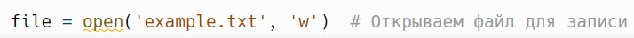

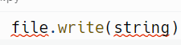

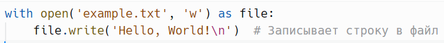

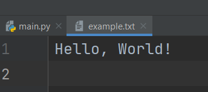

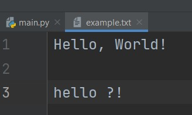

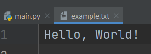

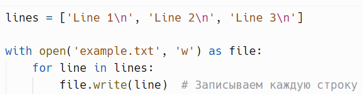

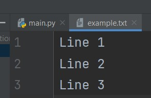

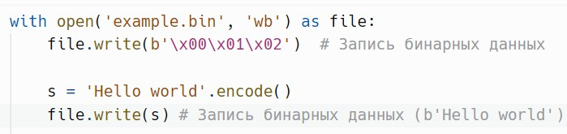

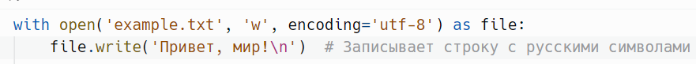

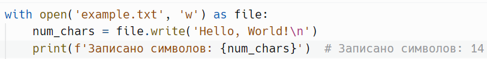
