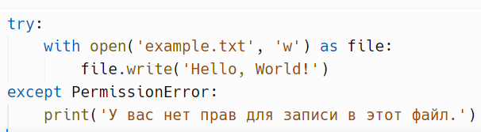
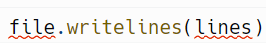
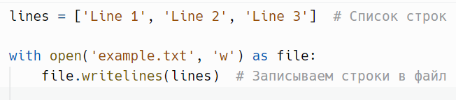
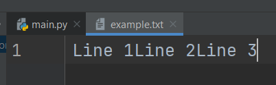
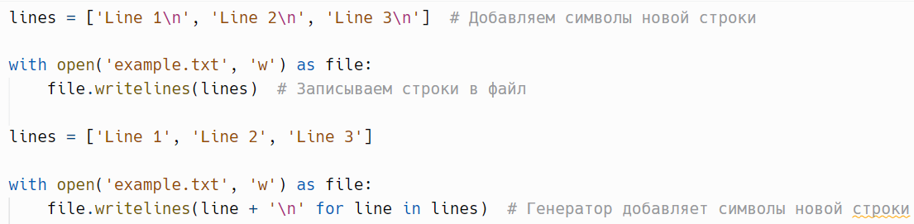
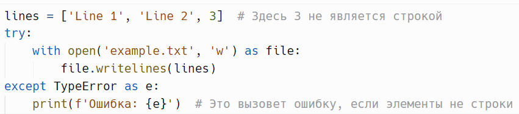
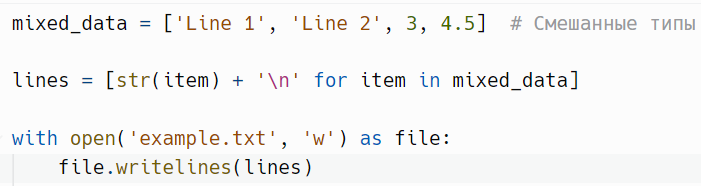

# Запись в файл: `writelines()`

> Источник: «СПРАВОЧНЫЕ МАТЕРИАЛЫ ПО PYTHON», страницы 435–437.

---
        writelines(*iterable) - используется для записи последовательности
строк в файл.
        Метод writelines() в Python используется для записи
последовательности строк в файл. В отличие от метода write(), который
принимает одну строку за раз, writelines() принимает и записывает список
строк. Однако важно понимать, что метод writelines() не добавляет
автоматически символы новой строки между записями, поэтому это нужно
делать вручную.
Синтаксис:

     lines: Это итерируемый объект, например, список или кортеж,
содержащий строки, которые вы хотите записать в файл.
Пример:

Результат:

     Обратите внимание, что строки записаны без пробелов или символов
новой строки между ними.
     Чтобы каждая строка записывалась на новой строке, вам нужно
добавить символы новой строки вручную или использовать генераторы для
добавления символов новой строки на лету.
Пример:

Если вы попытаетесь передать в writelines() список, содержащий не
только строки (например, целые числа или другие типы), это вызовет
TypeError. Всегда следует удостовериться, что все элементы являются
строками.
Пример:

      Порядок строк в списке или другом итерируемом объекте имеет
значение. В этом порядке строки будут записаны в файл, поэтому, если
порядок важен, убедитесь, что он правильный.
      Если ваш список или итерируемый объект содержит пустые строки,
они будут записаны в файл как пустые строки. Это может быть полезно для
оформления документации, но важно понимать, что пустые строки также
займут место в файле.
      Если у вас есть список, содержащий разные типы данных, можно
предварительно преобразовать все элементы в строки, доступными всеми
способами.
Пример:

     Все нюансы, о которых мы говорили в контексте метода write(),
также применимы и к методу writelines().

## Примеры и иллюстрации из исходника

