# Чтение из файла: `read(size)`

> Источник: «СПРАВОЧНЫЕ МАТЕРИАЛЫ ПО PYTHON», страницы 438–440.

ЧТЕНИЕ ИЗ                 ФАЙЛА            (ПРИ        ПОСЛЕДОВАТЕЛЬНОМ
ДОСТУПЕ)

     Для работы с файлами в Python используется функция open(), которая
принимает два основных аргумента: имя файла и режим доступа.
  ● 'r': Открывает файл для чтения. Файл должен существовать. Если
     файл не найден, будет вызвано исключение FileNotFoundError.
  ● 'rb': Открывает файл для чтения в бинарном режиме. Используется
     для работы с бинарными файлами (например, изображения, аудио).
     Файл должен существовать. Если файл не найден, будет вызвано
     исключение FileNotFoundError.
  ● 'r+': Открывает файл для чтения и записи. Файл должен существовать.
     Позволяет читать и изменять содержимое файла. Если файл не
     найден, будет вызвано исключение FileNotFoundError.
  ● 'r+b': Открывает файл для чтения и записи в бинарном режиме. Файл
     должен существовать. Позволяет читать и изменять бинарные
     данные. Если файл не найден, будет вызвано исключение
     FileNotFoundError.
Пример чтения из файла:

---
        read(size) - используется для считывания данных из текстового или
бинарного файла.
        Метод read(size) используется для считывания данных из текстового
или бинарного файла. Он позволяет управлять объемом считываемых
данных, что полезно при работе с большими файлами или при
необходимости контролировать память.
        size (необязательный): int. Указывает максимальное количество байт
или символов для чтения. Если size не задан, по умолчанию равен -1, что
означает, что метод читает весь оставшийся контент файла до конца.
        Возвращает строку (или байтовую строку в бинарном режиме) с
прочитанными данными. Если достигнут конец файла, возвращается пустая
строка ''.
        1. В примере ниже метод считывает весь текст из файла и выводит его
на экран.
Пример:

Файл:

Результат:

     Это происходит потому, что по умолчанию при чтении файла
используется кодировка ASCII. Поэтому, если в строках содержатся
русские символы, нужно явно указать кодировку.
     with open('example.txt', 'r', encoding='utf-8') as
file:
Результат:

     2. В примере ниже мы считываем только первые 11 байт. Если файл
меньше 11 байт, будут считаны все доступные данные.
Пример:

Результат:

     3. Использование read(size) для чтения больших файлов помогает
управлять памятью.
Пример:

4. Метод read(size) также можно использовать в бинарном режиме
для работы с не текстовыми файлами.
Пример:

      Если файл большой, и вы читаете его целиком, это может привести к
большим затратам памяти. Лучше использовать фиксированные размеры
блоков.
      Оптимальный размер блока зависит от ваших задач и системы, но
часто значения от 512 до 8192 байт подходят для большинства случаев.
      После вызова метода read(size) курсор перемещается на количество
прочитанных байт. Вы можете использовать метод seek() для перемещения
курсора, если необходимо прочитать данные из определенного места
файла.
      О seek() речь пойдет в дальнейших темах справочника.
      Когда достигнут конец файла, метод read(size) возвращает пустую
строку ''. Это важно учитывать в циклах чтения.
      Важно также правильно обрабатывать ситуацию, когда
запрашиваемый размер больше, чем доступные байты, чтобы избежать
лишних операций (len(data)).
      5. Рекомендуется обрабатывать возможные ошибки при записи в
файл, такие как ошибки доступа, недостаток дискового пространства и т.д.
Это можно сделать с помощью блока try-except.
Пример №1:
IOError / OSError

Эти ошибки возникают при работе с файлами и файловой системой.
Например, они могут возникнуть, если файл не существует, если нет прав
на его чтение или запись, или если диск переполнен.

Пример №2:
FileNotFoundError
     Эта ошибка возникает, когда пытаетесь открыть файл, который не
существует. Она является подклассом IOError.

---

## Примеры и иллюстрации из исходника

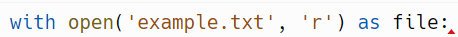

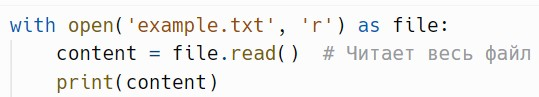

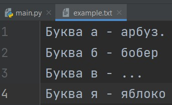

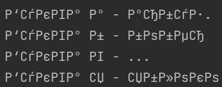

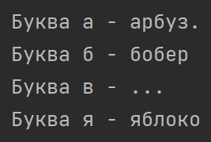

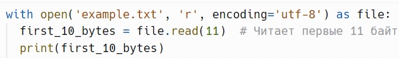

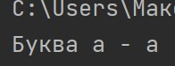

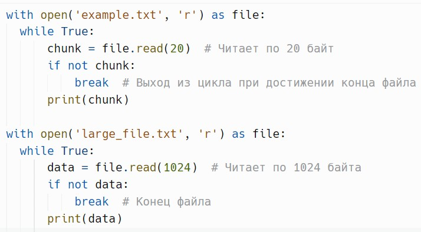

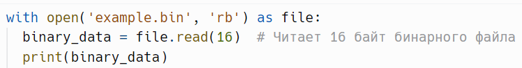

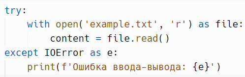

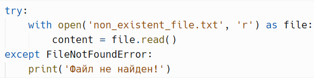

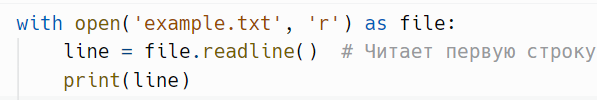
