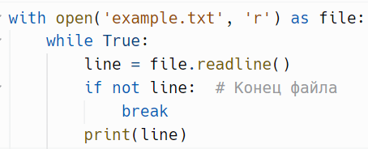
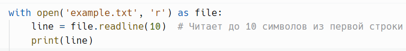
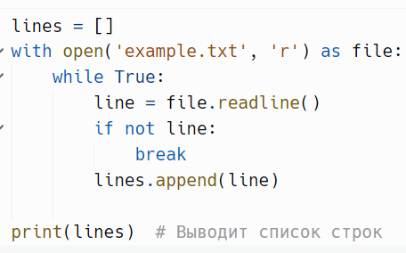
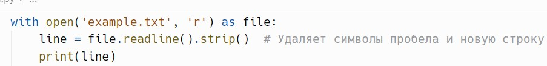
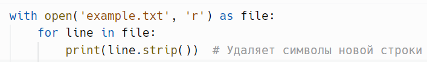
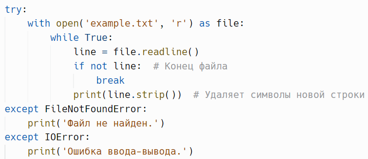

# Чтение из файла: `readline(size)`

> Источник: «СПРАВОЧНЫЕ МАТЕРИАЛЫ ПО PYTHON», страницы 441–443.

---
        readline(size) - считывает данные до символа новой строки (\n) или до
конца файла, в зависимости от того, что наступит раньше.
        Метод readline() читает одну строку из файла. Он считывает данные
до символа новой строки (\n) или до конца файла, в зависимости от того, что
наступит раньше.
Параметры
    ● size (необязательный):
            ○ Тип: int
            ○ Описание: Указывает максимальное количество символов
               (включая символ новой строки), которое нужно прочитать.
               Если size не указан или равен -1, считывается вся строка до
               символа новой строки.
Возвращаемое значение
    ● Возвращает строку, считанную из файла, включая символ новой
        строки в конце (если строка не является последней). Если достигнут
        конец файла, возвращается пустая строка ''.
Пример чтения одной строки:

Пример чтения нескольких строк:

Можно использовать цикл для последовательного чтения строк из
файла.
Пример чтения фиксированного количества символов:

     Вы можете ограничить количество символов, читаемых за раз.
Пример чтения всех строк в список:

     Если нужно получить все строки файла в виде списка, лучше
использовать метод readlines(), но можно также использовать readline() в
цикле.
Тонкости и рекомендации
1. Обработка символов новой строки:
      Обратите внимание, что метод readline() возвращает строку, включая
символ новой строки \n в конце. Если вы не хотите, чтобы он оставался, вы
можете использовать метод strip():
Пример:

2. Чтение с помощью for цикла:
      Вместо использования readline() в цикле, вы можете просто
итерироваться по файлу, что считается более идиоматическим в Python:
Пример:

3. Курсор чтения:

После вызова метода readline() курсор перемещается на следующую
строку. Каждый вызов readline() считывает следующую строку.
4. Конец файла (EOF):
      Когда достигнут конец файла, readline() возвращает пустую строку.
Это может использоваться для проверки, когда необходимо закончить цикл
чтения.
5. Производительность:
      Метод readline() удобен, когда нужно считывать строки по одной.
Однако для больших файлов лучше использовать метод readlines() или
итерацию по файлу, чтобы избежать дополнительных затрат на выполнение
условий цикла.
6. Обработка ошибок:
      При работе с файлами всегда рекомендуется обрабатывать
возможные ошибки, такие как FileNotFoundError и IOError.
Пример:

                          ЭЛЕМЕНТ ТЕОРИИ
      Идиоматический код в программировании — это код, написанный в
соответствии с лучшими практиками и стилевыми стандартами языка. Он
использует встроенные механизмы языка, которые делают его более
читаемым, эффективным и понятным для других разработчиков, знакомых
с этим языком.
      Когда говорят, что что-то "идиоматично" в Python, это значит, что
такой код написан так, как это обычно делают опытные программисты на
Python, используя наиболее удобные и правильные для этого языка
конструкции.
      Например, вместо использования метода readline() в цикле, более
идиоматичным является простая итерация по файлу, потому что это делает
код проще и удобнее:
Пример:

Этот подход проще и более читаем, чем:

     Идиоматический код в Python следует принципу "читаемость важнее
сложности" (один из принципов Python, описанных в PEP 20).

## Примеры и иллюстрации из исходника

