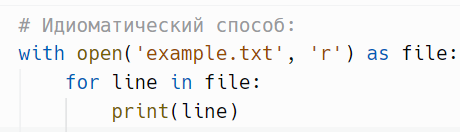
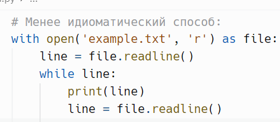
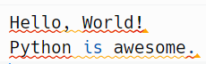
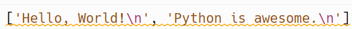
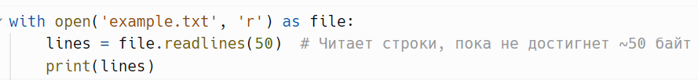
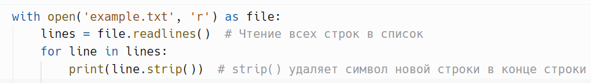
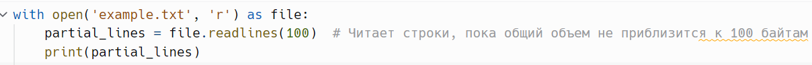

# Чтение из файла: `readlines(sizehint)`

> Источник: «СПРАВОЧНЫЕ МАТЕРИАЛЫ ПО PYTHON», страницы 444–446.

readlines(sizehint) - используется для чтения всех строк из файла и
возвращает их в виде списка.
      Метод readlines() в Python используется для чтения всех строк из
файла и возвращает их в виде списка. Каждая строка файла становится
элементом этого списка, включая символы новой строки (\n) в конце
каждой строки, если они есть в файле. Этот метод удобен, когда нужно
быстро загрузить все содержимое файла в память и обработать его
построчно.
Параметры
   ● sizehint — необязательный аргумент, который указывает, сколько
      байт или символов нужно прочитать. Если передан, метод пытается
      прочитать столько строк, чтобы общий объем прочитанных данных
      был равен sizehint. Если аргумент не указан, метод читает весь файл
      до конца.
Особенности и тонкости использования:
   1. Возвращаемый список: Каждая строка файла будет элементом
      списка, включая символ новой строки (\n). Если файл выглядит так:
Пример:

То вызов readlines() вернет следующий список:

     Использование sizehint: Если вы укажете аргумент sizehint, readlines()
попытается прочитать строки, суммарный размер которых приблизительно

равен переданному значению. Это полезно для того, чтобы избежать
загрузки слишком большого объема данных в память за один раз.
Пример:

      В этом случае метод может прочитать не все строки, а только
несколько, пока объем данных не приблизится к 50 байтам. Однако не
гарантируется точное соответствие объему — метод завершит чтение
текущей строки.
      Работа с большими файлами: Метод readlines() загружает все строки
файла в память сразу, что может стать проблемой при работе с большими
файлами, так как это может привести к нехватке памяти.
      Для таких случаев лучше использовать итерацию по файлу или
читать его частями с помощью других методов, таких как readline() или
простая итерация в цикле.
Пример:

      Здесь все строки файла считываются в список lines, а затем выводятся
на экран построчно. Метод strip() удаляет символ новой строки, чтобы он не
выводился повторно.
Когда лучше использовать readlines():
  ● Если файл небольшой, и вам нужно сразу получить все строки для
    дальнейшей обработки.
  ● Если нужно сохранить строки в списке для последующей работы с
    ними в произвольном порядке.
Когда лучше избегать readlines():
   ● При работе с большими файлами, так как он может перегрузить
     оперативную память.
   ● Если важна скорость работы, так как метод загружает сразу весь файл
     в память, что может быть менее эффективно по сравнению с
     построчной обработкой файла.
     Проблему с чтением больших файлов можно решить, используя
аргумент sizehint в функции readlines.
Пример:

     Здесь метод readlines() попытается прочитать строки суммарным
объемом 100 байт. Это может быть полезно, когда необходимо работать с

большим файлом, но вы хотите контролировать, сколько данных
загружается за раз.
      Если файл большой или вам нужно построчно обрабатывать его
содержимое, то более идиоматичным (правильным) будет использование
простой итерации по файлу.
      Метод readlines() полезен, когда требуется получить все строки файла
сразу и обработать их в виде списка. Однако его использование следует
ограничивать в ситуациях, когда работа ведется с большими файлами, так
как это может негативно сказаться на производительности и расходе
памяти. Для построчного чтения и обработки лучше использовать
итерацию по файлу или метод readline().

## Примеры и иллюстрации из исходника

