# Произвольный доступ: `seek()` и `tell()`

> Источник: «СПРАВОЧНЫЕ МАТЕРИАЛЫ ПО PYTHON», страницы 447–453.

ПРОИЗВОЛЬНЫЙ ДОСТУП. SEEK() И TELL()

        Произвольный доступ (random access) — это способ работы с
файлами, при котором данные могут быть прочитаны или записаны в
любом месте файла, не проходя через предыдущие данные
последовательно. Это значит, что вы можете перемещать указатель чтения
или записи на конкретную позицию в файле и работать с нужной частью
данных.
Основные особенности произвольного доступа:
    1. Гибкость перемещения по файлу: Вы можете переходить к любой
        позиции в файле с помощью метода seek(). Например, можно сразу
        перейти к середине файла и начать чтение или запись с этого места.
    2. Оптимизация работы с большими файлами: Если файл слишком
        большой, чтобы полностью загружать его в память, произвольный
        доступ позволяет работать с нужными частями файла. Это особенно
        важно при работе с большими базами данных, двоичными файлами
        или структурированными данными, такими как записи
        фиксированной длины.
    3. Эффективная запись данных: В отличие от последовательного
        доступа, где запись всегда происходит с конца файла, в
        произвольном доступе вы можете записывать данные в любом месте
        файла, переписывая или дополняя их.
---
        Метод seek() в Python используется для перемещения курсора (или
указателя позиции) внутри файла, что позволяет работать с произвольным
доступом к данным в файле. Он позволяет читать или записывать данные,
начиная с определенной позиции, без необходимости последовательно
проходить через весь файл. Это особенно полезно при работе с большими
файлами или структурированными данными.
Синтаксис:

      offset: Количество байтов, на которое необходимо сместить курсор.
whence (по умолчанию — 0): Определяет точку отсчета, от которой будет
производиться смещение:
   ● 0: Отсчет от начала файла. Это значение по умолчанию.
   ● 1: Отсчет от текущей позиции указателя.
   ● 2: Отсчет от конца файла.
Как работает seek():
   1. Начало файла (whence = 0): Если whence установлено в 0, то offset
      интерпретируется как количество байт от начала файла. Например,
      если указать seek(10), курсор переместится на 10-й байт с начала
      файла.

2. Текущая позиция (whence = 1): Указав whence равным 1, вы можете
     переместить курсор относительно текущего положения. Например,
     вызов seek(5, 1) переместит указатель на 5 байт вперед от текущей
     позиции.
  3. Конец файла (whence = 2): Установка whence в 2 позволяет смещать
     указатель от конца файла. Например, вызов seek(-10, 2) переместит
     курсор на 10 байт перед концом файла.
Пример 1: Перемещение к определенной позиции

Результат:

      Этот код перемещает указатель на 10-й байт в файле и читает 5 байт с
этой позиции.
Пример 2: Перемещение относительно текущей позиции

Результат:

     Ошибка io.UnsupportedOperation: can't do nonzero cur-relative seeks
возникает, когда вы пытаетесь использовать режим смещения
относительно текущей позиции (whence=1) в текстовом режиме. Текстовые
файлы в Python не поддерживают смещение на основе текущей позиции, за
исключением смещения на 0 байт.
     Это ограничение связано с тем, что в текстовом режиме
интерпретатор Python может использовать различные кодировки для
символов, и размер одного символа может быть больше одного байта
(например, в кодировке UTF-8). Таким образом, Python не может точно
предсказать, сколько байт нужно пропустить для перемещения указателя
относительно текущей позиции.
     Если вам нужно работать с произвольным доступом и использовать
смещения относительно текущей позиции, вам нужно открыть файл в

бинарном режиме ('rb' или 'r+b'), поскольку в бинарном режиме курсор
перемещается по байтам, а не по символам.
Использование бинарного режима для произвольного доступа:

Результат:

Пример 3: Перемещение относительно конца файла

        Аналогично и с перемещением относительно конца файла. Доступно
только в бинарном режиме.
---
                                   ЭЛЕМЕНТ ТЕОРИИ
        В текстовом файле символы не всегда занимают 1 байт, особенно
если файл закодирован в кодировке, поддерживающей многобайтовые
символы, такой как UTF-8. В кодировке UTF-8, которая является одной из
наиболее популярных для Unicode, символы могут занимать от 1 до 4 байт в
зависимости от их представления.
        В кодировке ASCII, которая охватывает только символы латинского
алфавита и стандартные символы, каждый символ действительно занимает
1 байт.
В кодировке UTF-8:
    ● Символы из базового латинского набора (например, английские
        буквы, цифры) также занимают 1 байт.
    ● Более сложные символы, например, кириллические символы или
        иероглифы, могут занимать 2 байта или больше.
    ● Некоторые редкие символы могут занимать 3-4 байта.
Как read(10) работает с текстовыми файлами:
    ● Если файл открыт в текстовом режиме ('r'), то при использовании
        метода read(10) вы считаете 10 символов, а не байтов. Это важно, так
        как символы могут занимать разное количество байтов.
    ● Если файл открыт в бинарном режиме ('rb'), то read(10) действительно
        считывает 10 байт независимо от того, какие символы представлены в
        этих байтах.

В бинарном режиме ('rb') Python работает напрямую с байтами, а не с
символами. Это значит, что когда вы используете метод read(10) в
бинарном файле, вы действительно считываете 10 байт, а не 10 символов. И
если некоторые символы занимают больше 1 байта (например, в кодировке
UTF-8), то вы можете получить только часть символа.
      Предположим, что в вашем файле есть слово с символами, которые
имеют разный размер в байтах. Например, файл содержит текст "Привет" в
кодировке UTF-8. В UTF-8 кириллические символы (как в слове "Привет")
занимают 2 байта каждый.
Сценарий:
   ● "Привет" — это 6 символов, но каждый из них занимает 2 байта в
      кодировке UTF-8. В итоге, это 12 байт данных.
   ● Если вы вызовете read(10) в бинарном режиме, вы считаете 10 байт,
      что может быть неполным набором символов.
Что произойдет:
   ● Вы считаете первые 10 байт.
   ● Первые 5 символов (из 6) в строке "Привет" будут считаны
      полностью, потому что они занимают ровно 10 байт.
   ● Однако последний байт будет содержать только часть шестого
      символа, и этот символ не будет завершен корректно.
Пример:

Результат:
   ● data:    Считанные       10     байт    будут    выглядеть     так:
     b'\xd0\x9f\xd1\x80\xd0\xb8\xd0\xb2\xd0\xb5'.
   ● Если вы попытаетесь декодировать 11 байт в строку с
     использованием UTF-8, то получите ошибку декодирования
     (UnicodeDecodeError), потому что последний байт (\xd0) — это
     только половина символа "т".
     Чтобы избежать таких проблем, при работе с текстом лучше
использовать текстовый режим ('r') вместо бинарного режима, потому что в

текстовом режиме Python сам заботится о корректной обработке кодировки
символов.
        Если вам нужно работать с бинарными данными, и вы хотите
считывать их частями, вам придётся учитывать, сколько байт каждый
символ занимает, чтобы не "разрывать" символы при чтении.
        В бинарном режиме read(10) считывает именно байты, и если символ
занимает несколько байт (например, кириллический символ в UTF-8), есть
риск прочитать только часть символа. Чтобы корректно обрабатывать такие
ситуации, нужно либо работать в текстовом режиме, либо тщательно
следить за границами символов в бинарных данных.
---
        Метод tell() в Python используется для получения текущей позиции
указателя чтения/записи в файле. Он возвращает целое число, которое
представляет собой количество байт от начала файла до текущей позиции
указателя. Этот метод особенно полезен, если вам нужно отслеживать, где в
файле вы находитесь в процессе его чтения или записи.
Основные особенности tell():
    1. Возвращает позицию в байтах:
            ○ tell() всегда возвращает позицию указателя в байтах, даже если
               файл открыт в текстовом режиме.
    2. Работа с текстовыми файлами:
            ○ Если файл открыт в текстовом режиме (например, 'r', 'w', 'a'),
               позиция, возвращаемая tell(), всё равно будет измеряться в
               байтах, а не в символах. Это важно, так как в некоторых
               кодировках (например, UTF-8) один символ может занимать
               несколько байт.
            ○ Python использует буфер при работе с текстовыми файлами.
               Это означает, что результат tell() может не всегда точно
               соответствовать позиции символа в строке из-за буферизации,
               которая может скрывать реальную байтовую позицию.
    3. Работа с бинарными файлами:
            ○ В бинарном режиме ('rb', 'wb', 'ab') метод tell() показывает
               точное количество байт, которые уже были прочитаны или
               записаны.
    4. Совместное использование с seek():
            ○ tell() часто используется вместе с методом seek(), чтобы
               передвинуть указатель на нужную позицию или проверить, где
               находится указатель перед перемещением.
Пример 1: Работа с текстовым файлом

Результат:

Пример 2: Работа с бинарным файлом

Результат:

     В бинарном файле позиция, возвращенная методом tell(), точно
соответствует числу прочитанных байт.
Пример 3: Комбинирование с seek()

Результат:

## Примеры и иллюстрации из исходника

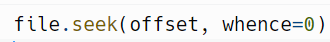

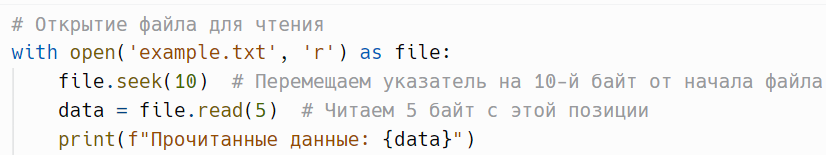

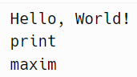

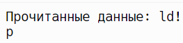

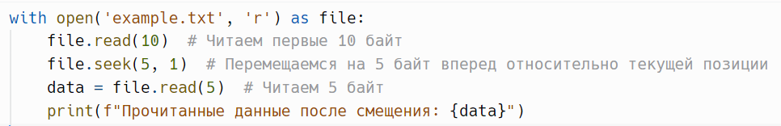

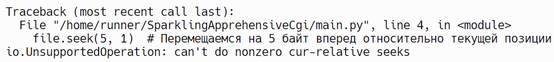

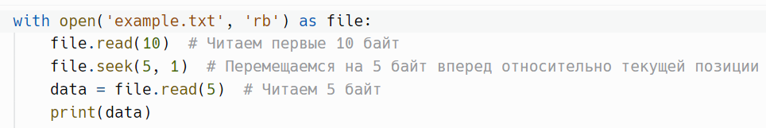

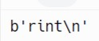

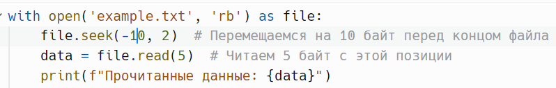

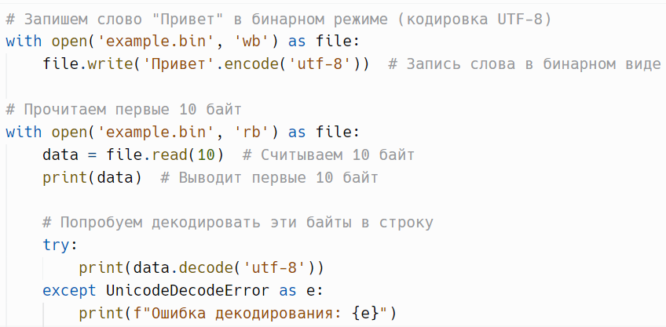

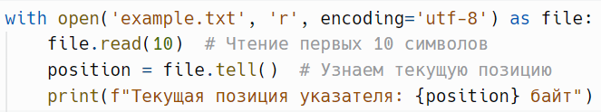

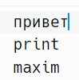

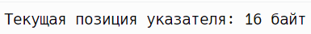

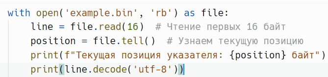

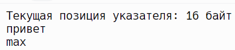

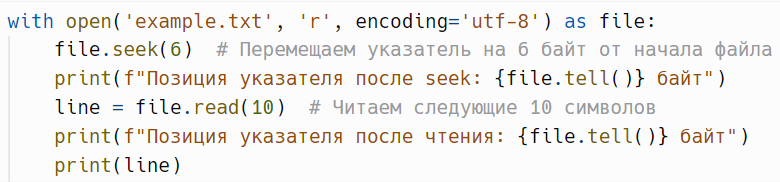

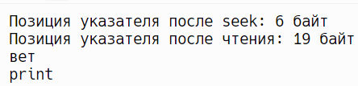
