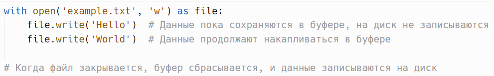
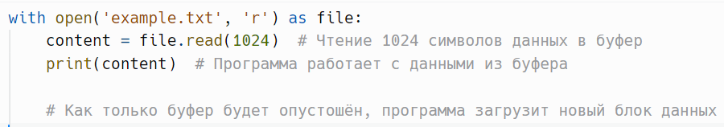
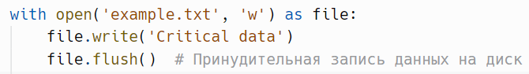
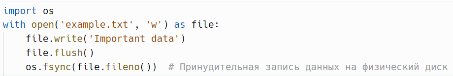

# Буфер и буферизация

> Источник: «СПРАВОЧНЫЕ МАТЕРИАЛЫ ПО PYTHON», страницы 454–459.

БУФЕР И БУФЕРИЗАЦИЯ

      Буфер — это временная область памяти (RAM), используемая для
временного хранения данных во время их передачи между различными
компонентами системы. Основная цель буферизации — улучшить
производительность и эффективность обработки данных, а также
синхронизировать работу устройств с разными скоростями передачи
данных.
Основные концепции буферов:
   1. Временное хранение данных: Буфер используется для хранения
      данных на короткий промежуток времени, пока они передаются
      между источником и получателем. Например, при записи данных на
      медленный диск, буфер помогает избежать задержек, позволяя
      программе продолжать работу, пока данные не будут окончательно
      записаны.
   2. Снижение количества операций ввода-вывода: Буферизация
      уменьшает количество обращений к физическим устройствам, таким
      как диск или сеть, что ускоряет работу программы. Например, данные
      могут накапливаться в буфере, а затем записываться на диск или
      отправляться по сети большими блоками.
   3. Синхронизация работы устройств с разными скоростями:
      Буферы помогают "сглаживать" различия в скорости между двумя
      системами. Например, центральный процессор может обрабатывать
      данные гораздо быстрее, чем сеть может их передавать. В этом случае
      буфер используется для накопления данных, которые затем
      передаются с той скоростью, с которой их может принять сеть.
Типы буферов:
   1. Буферы в памяти (RAM): Такие буферы временно хранят данные
      для быстрого доступа во время их обработки. Например, при записи
      файлов данные сначала помещаются в буфер оперативной памяти, а
      затем записываются на диск.
   2. Буферы на диске: Некоторые системы могут использовать файловые
      буферы, которые хранят данные на диске до их обработки или
      передачи.
   3. Буферы сетевой передачи: В сетях данные передаются пакетами, и
      буферизация помогает собирать пакеты до того, как они будут
      переданы по сети или получены от удаленных устройств.
Как работает буферизация:
   ● Запись данных: Программа записывает данные не напрямую на диск
      или в сеть, а в буфер. Это позволяет программе продолжать
      выполнение задач, не дожидаясь окончания операции записи. Когда

буфер заполнен, данные передаются большими блоками на диск или
      в сеть, что снижает нагрузку на систему.
   ● Чтение данных: Когда данные считываются с диска или сети, они
      могут быть переданы в буфер для временного хранения, после чего
      программа извлекает их по мере необходимости. Это позволяет
      уменьшить количество обращений к медленным устройствам, таким
      как жесткие диски или сети.
Примеры использования буферов:
   1. Буферизация при потоковом воспроизведении видео: При
      потоковой передаче видео или аудио данные сначала загружаются в
      буфер, чтобы воспроизведение не зависело от колебаний скорости
      интернета. Буфер накапливает данные, а затем передает их для
      воспроизведения без пауз и задержек.
   2. Буферизация при записи файлов: Когда программа записывает
      данные на диск, данные сначала попадают в буфер, который хранит
      их до тех пор, пока не наберется достаточно большой блок для
      записи. Это ускоряет работу с файлами и уменьшает количество
      операций записи на диск.
   3. Буферы в принтерах: Принтеры обычно работают медленнее, чем
      компьютер, который отправляет им данные. Поэтому данные для
      печати сначала передаются в буфер, откуда они по мере готовности
      отправляются на печать.
Преимущества использования буферов:
   ● Повышение производительности: Программа может продолжать
      выполнение задач, не дожидаясь завершения медленных операций
      ввода-вывода (например, записи на диск или в сеть).
   ● Уменьшение числа операций I/O: Запись данных большими
      блоками значительно ускоряет работу файловых систем и сетей.
   ● Синхронизация разной скорости работы компонентов:
      Буферизация помогает согласовать работу устройств с разными
      скоростями передачи данных.
Недостатки буферов:
   ● Задержки в передаче данных: Если буфер слишком большой, это
      может привести к задержкам в передаче или записи данных, так как
      они будут отправляться только после того, как буфер заполнится.
   ● Потеря данных: В случае сбоя программы или системы данные,
      находящиеся в буфере, могут быть потеряны, если они не успели
      записаться на диск или передаться по сети.
      Буфер — это ключевой элемент в программировании и работе
операционных систем, помогающий оптимизировать процесс передачи
данных и улучшить взаимодействие между устройствами с разными
скоростями работы.
Реальный пример:

Если процессор выполняет свою работу быстрее, чем сеть или любое
другое устройство (например, жесткий диск или принтер) может принять
или обработать данные, буфер играет роль промежуточного хранилища.
Как это работает:
    1. Процессор генерирует данные — допустим, это данные, которые
        нужно передать по сети или записать на диск.
    2. Данные помещаются в буфер — буфер сохраняет данные,
        освобождая процессор для выполнения других задач. Процессор
        может продолжить свою работу без необходимости ждать
        завершения медленных операций ввода-вывода (например, записи
        или передачи по сети).
    3. Буфер постепенно освобождается — когда сеть или другое
        устройство готово принять данные, буфер начинает передавать их.
        Это может происходить медленнее, чем процессор обрабатывает
        данные, но сам процессор уже не задействован в этом процессе и
        продолжает выполнять другие задачи.
        Представим, что компьютер отправляет большой файл по сети.
Процессор может быстро подготовить данные для отправки, но скорость
сети ограничена, и данные передаются медленнее. Вместо того чтобы
процессор ожидал завершения передачи каждого куска данных, он передает
их в буфер. Буфер, в свою очередь, отправляет данные по сети по мере того,
как сеть может их принимать. Таким образом, процессор может сразу
начать обрабатывать другие задачи.
Основные преимущества буферизации в этом контексте:
    ● Процессор не простаивает, ожидая завершения медленных операций.
        Это делает работу системы более эффективной.
    ● Буфер обеспечивает плавную передачу данных, избегая возможных
        задержек или разрывов, связанных с временной нехваткой
        пропускной способности сети.
---
        Буферизация — это важный механизм, который улучшает
производительность при работе с файлами, сводя к минимуму количество
обращений к файловой системе, так как такие операции могут быть
относительно медленными.
        Когда программа записывает данные в файл, она может не
записывать их сразу на диск. Вместо этого данные сначала сохраняются в
буфере — области в оперативной памяти. Буферизация позволяет
накапливать данные до тех пор, пока они не достигнут определённого
объёма (размера буфера). После этого данные "сбрасываются" на диск
одним большим блоком, что снижает количество операций ввода-вывода
(I/O) и повышает производительность.
Как работает буферизация при записи:

1. Запись данных в буфер: При вызове метода write() данные не всегда
     сразу записываются на диск. Они временно сохраняются в буфере.
     Например, если буфер настроен на 8 КБ, то данные будут
     накапливаться, пока не заполнят этот объём.
  2. Сброс данных (flush): Как только буфер заполняется или вызывается
     метод flush(), накопленные данные записываются на диск.
     Буферизация сводит к минимуму количество обращений к файловой
     системе, так как запись больших блоков данных значительно
     быстрее, чем частая запись небольших порций.
  3. Закрытие файла: При закрытии файла (например, с помощью close()
     или автоматического закрытия файла в контекстном менеджере with)
     данные, находящиеся в буфере, записываются на диск. Это
     гарантирует, что ничего не останется в памяти, и файл будет
     завершён корректно.
Пример:

       Буферизация эффективна, потому что диск записывает данные
быстрее, если они передаются большими порциями. Если бы каждый вызов
write() напрямую записывал данные на диск, это могло бы замедлить
процесс, так как файловая система требует больше ресурсов для частых
операций записи.
       При чтении данных из файла, вместо того чтобы каждый раз
обращаться к диску за небольшими кусками данных, программа читает
большие блоки и сохраняет их в буфере. После этого данные извлекаются
из буфера по мере необходимости.
Как работает буферизация при чтении:
   1. Чтение данных в буфер: Когда программа вызывает метод read(),
       данные считываются с диска блоками. Размер блоков зависит от
       настроек буферизации. Например, при чтении большого файла буфер
       может быть настроен на 4 КБ или 8 КБ.
   2. Извлечение данных из буфера: Программа работает с данными в
       буфере, пока он не опустеет. Когда данные в буфере заканчиваются,
       программа снова обращается к диску, загружает следующий блок
       данных в буфер и продолжает работу с ними.
   3. Снижение количества обращений к диску: Благодаря буферизации
       программа не обращается к диску каждый раз, когда ей нужны
       данные. Вместо этого происходит одно чтение большого блока
       данных, что снижает нагрузку на диск и улучшает
       производительность.

Пример:

      Этот подход значительно эффективнее, чем чтение по одному байту
или символу, так как файловая система работает быстрее с большими
блоками данных.
      Python позволяет вам управлять тем, как работает буферизация, через
функцию open(). Вы можете настроить степень буферизации при открытии
файла с помощью параметра buffering:
   1. buffering=-1 (по умолчанию): Полная буферизация. Размер буфера
      определяется автоматически.
   2. buffering=0: Отключение буферизации. Данные записываются и
      читаются немедленно. Этот режим доступен только в бинарном
      режиме.
   3. buffering=1: Буферизация по строкам. Данные записываются на диск
      после каждой новой строки.
   4. buffering>1: Полная буферизация с явным указанием размера буфера
      (в байтах).
Методы для управления буферизацией:
      flush(): Этот метод принудительно сбрасывает данные из буфера на
диск, даже если буфер ещё не заполнен. Например, если вы записали
данные в файл, но хотите, чтобы они немедленно оказались на диске,
вызывайте flush().
Пример:

     os.fsync(): Принудительная синхронизация данных с физическим
носителем (диском). Используется в критических системах, где важно сразу
записать данные на диск, чтобы избежать их потери в случае сбоя.
Пример:

Недостатки:
  ● Данные могут оставаться в буфере до тех пор, пока он не заполнится
     или файл не будет закрыт. Это означает, что в случае сбоя системы до
     завершения записи данные могут быть потеряны.

● Иногда требуется явное управление буферизацией с использованием
  методов flush() и fsync(), чтобы гарантировать немедленную запись
  данных.

## Примеры и иллюстрации из исходника

