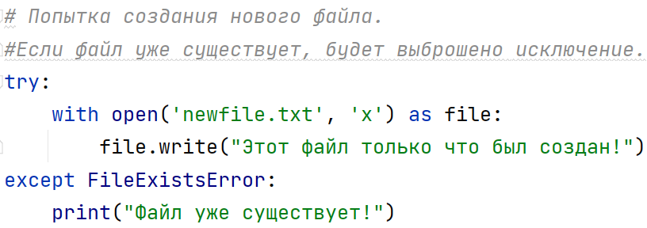

# Режим `x`

> Источник: «СПРАВОЧНЫЕ МАТЕРИАЛЫ ПО PYTHON», страницы 460.

РЕЖИМ ‘X’

Режим 'x' — создание нового файла.
     Режим 'x' используется для создания нового файла. Если файл с таким
именем уже существует, то будет выброшено исключение FileExistsError.
Особенности режима 'x':
  ● Он не перезаписывает существующий файл. Это важно для защиты
     данных от случайной перезаписи.
  ● Если файл с таким именем уже существует, возникает исключение.
  ● Поддерживает как текстовые, так и бинарные файлы (можно
     использовать 'x' или 'xb' для бинарных данных).
Пример:

В этом примере:
  ● Файл newfile.txt будет создан, если его нет в папке.
  ● Если файл уже существует, программа выбросит исключение и
    сообщит, что файл уже существует.
Применение:
  ● Этот режим полезен, когда вы хотите гарантировать, что
    создаваемый файл будет новым, а существующие файлы не будут
    затронуты.

## Примеры и иллюстрации из исходника

