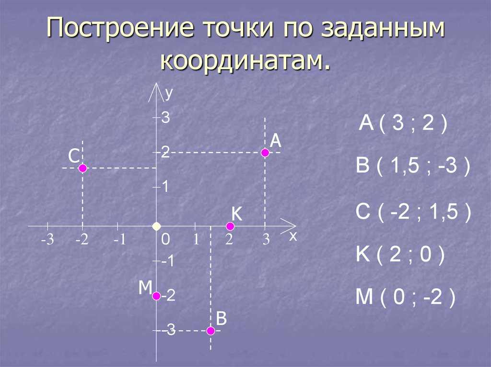
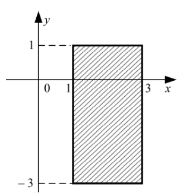
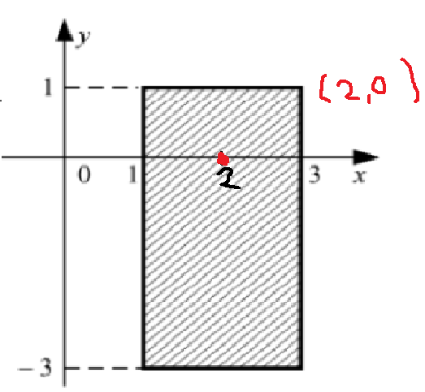
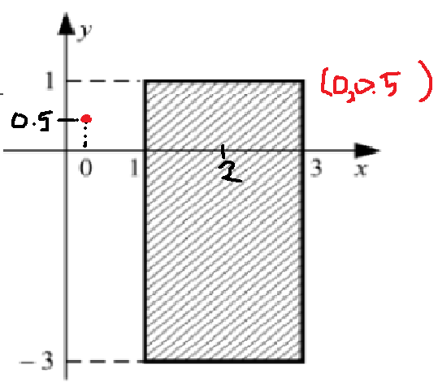

> «Разбираться в основах — значит экономить время в будущем.»


[Практика: итераторы и итерируемые объекты в Python](https://buildin.ai/fd6a510e-09f0-4fd9-a8c5-319bae8afe52)


**Паспорт темы**

    Категория: синтаксис и базовые концепции

    Уровень: начальный

    Связанные темы: циклы, генераторы

    Зачем это знать: понимать, как работает перебор

---

В Python можно удобно проверять, находится ли значение **внутри диапазона**.

Для этого используется **двойное сравнение**:

```Python
a <= x <= b
```

Это означает:

```Python
a <= x and x <= b
```

То есть Python проверяет, что значение `x` **не меньше левой границы** и **не больше правой границы**.

---

# Пример диапазона

```Python
x = 2

print(1 <= x <= 3)
```

Результат:

```Python
True
```

Потому что число `2` находится в диапазоне от `1` до `3`.

---

# Задача с координатами точки

Пусть нужно составить условие, которое будет истинным, если точка с координатами **(x, y)** попадает в заштрихованную область, включая границы.

По условию видно, что точка попадает в нужную область, если:

- координата `x` находится в диапазоне **[1; 3]**

- координата `y` находится в диапазоне **[-3; 1]**









---

# Условие на Python

Тогда условие можно записать так:

```Python
1 <= x <= 3 and -3 <= y <= 1
```

Это означает:

- `x` от 1 до 3 включительно

- `y` от -3 до 1 включительно

Оператор `and` требует, чтобы **оба условия были истинными одновременно**.

---

# Полный пример программы

```Python
x = 2
y = 0

print(1 <= x <= 3 and -3 <= y <= 1)
```

Результат:

```Python
True
```

Точка **(2, 0)** попадает в область.

---

# Пример, когда точка не подходит

```Python
x = 0
y = 0.5

print(1 <= x <= 3 and -3 <= y <= 1)
```

Результат:

```Python
False
```

Хотя `y = 0.5` подходит, значение `x = 0` **не входит** в диапазон `[1; 3]`.

---

# Почему это удобно

Вместо длинной записи:

```Python
x >= 1 and x <= 3 and y >= -3 and y <= 1
```

можно использовать более короткую и понятную форму:

```Python
1 <= x <= 3 and -3 <= y <= 1
```

---

# Итог

В Python двойное сравнение позволяет удобно проверять, принадлежит ли значение диапазону.

Пример:

```Python
1 <= x <= 3
```

означает:

```Python
x находится в диапазоне от 1 до 3 включительно
```

Для точки `(x, y)` условие попадания в прямоугольную область записывается как:

```Python
1 <= x <= 3 and -3 <= y <= 1
```

---
