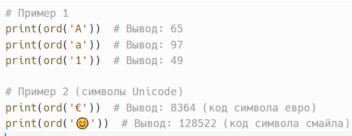
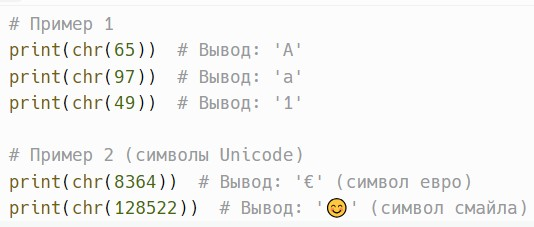

# Unicode: функции ord() и chr()

> Исходник: страницы 346.

<!-- Страница 346 -->

Функция ord(char) принимает один символ (строку длиной 1) и
возвращает его целочисленное представление в кодировке Unicode.

char: Один символ, для которого нужно получить целочисленное
значение.

Возвращает целое число, представляющее код символа в Unicode.
Пример:

Функция chr(integer) принимает целое число и возвращает символ,
соответствующий этому числу в кодировке Unicode.
integer: Целое число, представляющее код символа в Unicode.

Возвращает строку, состоящую из одного символа,
соответствующего переданному целочисленному значению.
Пример:

Кодовые точки для символов могут быть в диапазоне от 0 до
1,114,111 (0x10FFFF), что охватывает все символы в стандарте Unicode.

Функция ord() вызывает исключение TypeError, если передан пустой
аргумент или строка длиной больше одного символа.

Функция chr() вызывает исключение ValueError, если передано
число, которое не соответствует никакому символу в Unicode.
