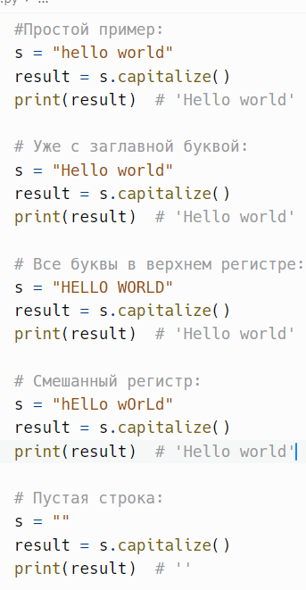
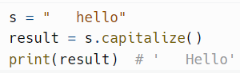
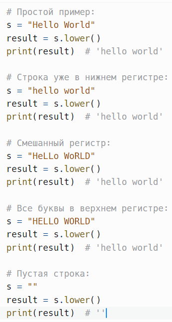
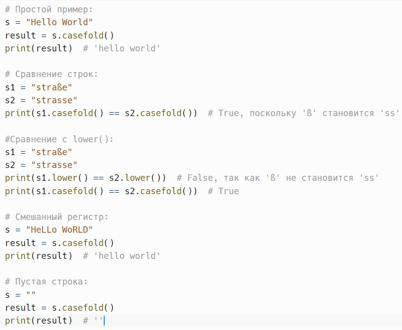

# Регистры строк: capitalize(), lower(), casefold()

> Исходник: страницы 347–349.

<!-- Страница 347 -->

## Строковые методы и функции

capitalize() - возвращает новую строку с первой буквой в заглавном
регистре, а все остальные буквы в строчном.

Метод capitalize() в Python — это встроенный метод строк, который
возвращает новую строку с первой буквой в заглавном регистре, а все
остальные буквы в строчном.

Метод capitalize() не принимает никаких параметров.
Пример:

Метод capitalize() изменяет только первую букву строки. Все
остальные символы становятся строчными, независимо от их исходного
регистра.

Если строка начинается с непечатаемого символа (например, пробела
или табуляции), метод capitalize() все равно изменит первую букву после
этих символов.
Пример:

<!-- Страница 348 -->

Метод возвращает новую строку и не изменяет исходную строку.
Строки в Python неизменяемы (immutable), поэтому любое изменение
создаёт новую строку.

---

lower() - возвращает копию строки в нижнем регистре.
Метод lower() в Python — это встроенный метод строк, который
возвращает новую строку, преобразованную в нижний регистр. Этот метод
полезен для стандартного преобразования текста, когда нужно
игнорировать регистр букв.

Метод lower() не принимает никаких параметров.
Пример:

Метод lower() возвращает новую строку и не изменяет исходную
строку. Строки в Python являются неизменяемыми (immutable), что
означает, что любые операции, изменяющие строку, создают новую строку.

<!-- Страница 349 -->

Метод lower() работает с символами Unicode. Он правильно
обрабатывает строки, содержащие буквы из различных алфавитов.

---

casefold() - возвращает копию строки в нижнем регистре,
предназначенную для более агрессивного сравнения строк. Похож на
lower(), но сильнее.

Метод casefold() в Python — это метод строк, который возвращает
копию строки, преобразованную в нижний регистр. Он предназначен для
более "агрессивного" (или универсального) сравнения строк, чем метод
lower().

Метод casefold() не принимает никаких параметров.
Метод casefold() предназначен для более точного сравнения строк,
особенно в многоязычных контекстах. Он учитывает особенности
некоторых алфавитов, таких как немецкий, где буква "ß" может
преобразовываться в "ss". Работает лучше с символами Unicode и
учитывает большее количество языковых особенностей.
Пример:

---
