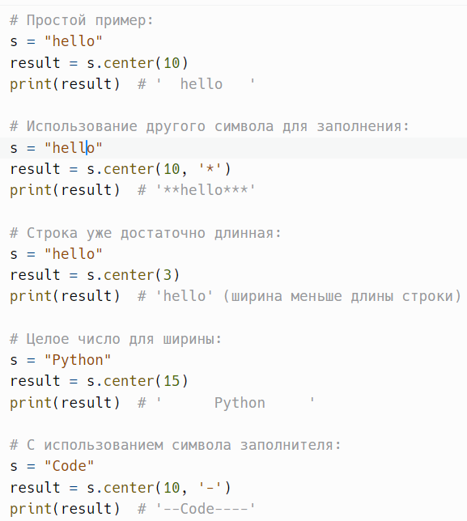
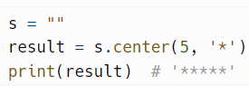
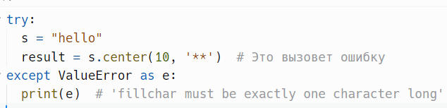
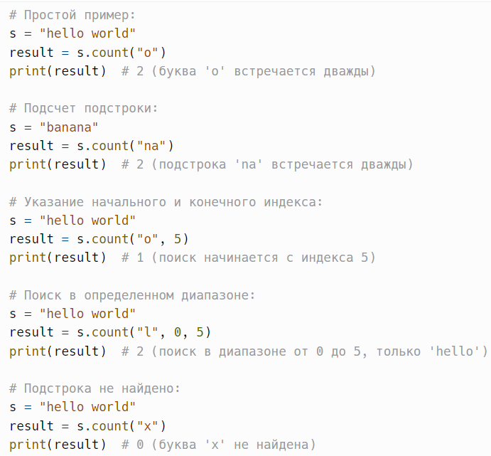
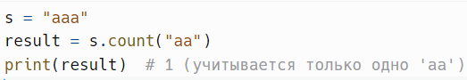
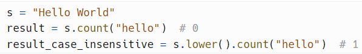
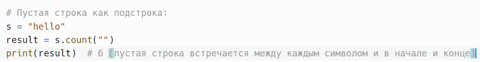

# Выравнивание и подсчет: center() и count()

> Исходник: страницы 350–353.

<!-- Страница 350 -->

center(width, fillchar=' ') - возвращает новую строку, центрированную
в строке длиной width. по умолчанию используется пробел для заполнения.

Метод center() в Python — это встроенный метод строк, который
возвращает новую строку, отцентрированную в строке заданной длины.
Если длина строки меньше указанной ширины, метод заполняет пустое
пространство с обеих сторон строки символом, указанным в качестве
второго параметра (по умолчанию — пробелом).

width: int — целочисленный параметр, который указывает желаемую
ширину результирующей строки.

fillchar: str — (по умолчанию пробел) — символ, который будет
использован для заполнения пустого пространства, если длина строки
меньше ширины. Это значение должно состоять из одного символа.
Пример:

Метод center() возвращает новую строку и не изменяет исходную
строку. Строки в Python являются неизменяемыми (immutable).

Если исходная строка пуста, метод вернет строку, заполненную
символом fillchar, если ширина больше нуля.
Пример:

<!-- Страница 351 -->

Если передать строку из нескольких символов в качестве fillchar,
будет вызвано исключение ValueError.
Пример:

---

count(substring, start=0, end=len(string)) - возвращает количество
непересекающихся вхождений подстроки substring в строке.

Метод count() в Python — это встроенный метод строк, который
возвращает количество непересекающихся вхождений заданной подстроки
в строке. Этот метод позволяет удобно подсчитывать, сколько раз
определенная последовательность символов встречается в строке.

substring: str — подстрока, количество вхождений которой вы хотите
подсчитать.

start: int (по умолчанию 0) — начальный индекс, с которого
начинается поиск.

end: int (по умолчанию длина строки) — конечный индекс, по
которому будет производиться поиск.

Метод возвращает целое число, представляющее количество
непересекающихся вхождений подстроки substring в строке. Если
подстрока не найдена, будет возвращено значение 0.
Пример:

<!-- Страница 352 -->

Метод count() подсчитывает только непересекающиеся вхождения
подстроки. Это означает, что если подстрока может частично
перекрываться (например, в случае повторяющейся последовательности),
она будет учтена только один раз.
Пример:

Метод count() учитывает регистр. Если вам нужно подсчитать
количество вхождений без учета регистра, следует сначала привести строку
и подстроку к одному регистру.
Пример:

Пустая строка "" считается подстрокой и будет найдена между
каждым символом, а также в начале и конце строки. Это приводит к тому,
что результатом будет длина строки + 1.
Пример:

<!-- Страница 353 -->

Метод count() проходит по всей строке, поэтому для очень длинных
строк может иметь высокую временную сложность.

---
