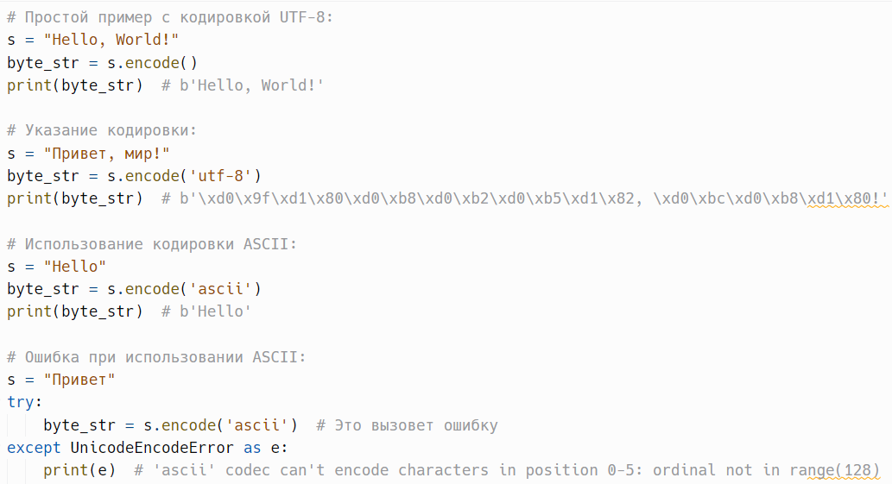
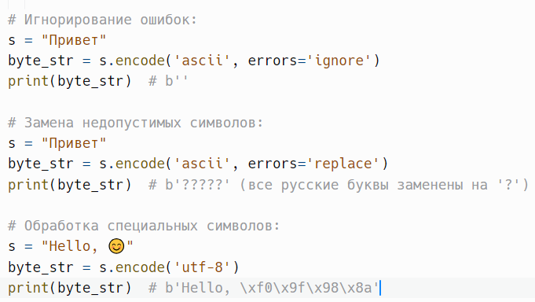
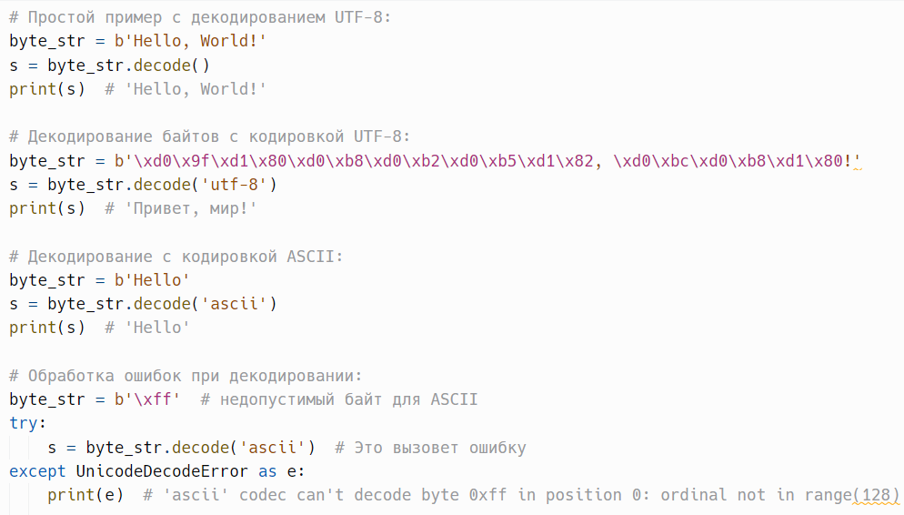
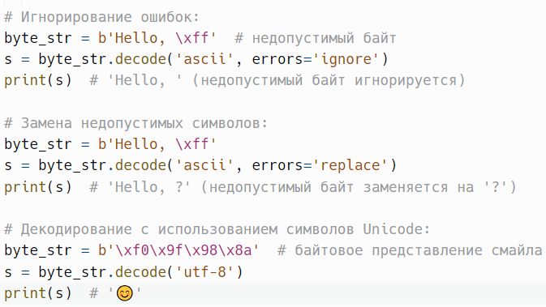

# Кодирование и декодирование: encode() и decode()

> Исходник: страницы 353–356.

<!-- Страница 353 -->

encode(encoding='utf-8', errors='strict') -
возвращает байтовое
представление строки, закодированное с использованием заданной
кодировки.

Метод encode() в Python — это встроенный метод строк, который
возвращает байтовое представление строки, закодированное с
использованием заданной кодировки. Это позволяет преобразовать строки
(которые являются последовательностями символов) в байты, что важно
для работы с данными, такими как файлы, сети и базы данных.

encoding: str (по умолчанию 'utf-8') — строка, указывающая на
желаемую кодировку. Наиболее часто используемые кодировки:

●'utf-8': наиболее распространенная кодировка, поддерживающая все

символы Unicode.
●'ascii': кодировка, поддерживающая только символы ASCII (от 0 до

127).
●'latin-1': кодировка, поддерживающая символы из многих

западноевропейских языков.
errors: str (по умолчанию 'strict') — определяет, как обрабатывать
ошибки, возникающие при кодировании. Возможные значения:

●'strict': вызывает исключение при возникновении ошибки (по

умолчанию).
●'ignore': игнорирует ошибки и пропускает недопустимые символы.
●'replace': заменяет недопустимые символы символом ? или аналогом.
●'backslashreplace': заменяет недопустимые символы специальным

представлением в виде последовательности.
Метод возвращает объект типа bytes, представляющий
закодированную строку.
Пример:

<!-- Страница 354 -->

Метод encode() возвращает новый объект типа bytes и не изменяет
исходную строку. Строки в Python неизменяемы (immutable).

При работе с различными кодировками важно помнить, что не все
символы могут быть закодированы в каждой кодировке. Например,
символы, выходящие за пределы ASCII, не могут быть закодированы в
кодировке ASCII.

Для преобразования байтового представления обратно в строку
используется метод decode().

Кодирование строк в байты может повлиять на производительность,
особенно для больших объемов данных, поэтому необходимо выбирать
подходящие кодировки и обрабатывать ошибки соответствующим образом.

---

<!-- Страница 355 -->

decode() - используется для преобразования байтового представления
(объекта типа bytes) обратно в строку (объект типа str).

Метод decode() в Python — это встроенный метод, который
используется для преобразования байтового представления (объекта типа
bytes) обратно в строку (объект типа str). Этот метод позволяет
декодировать байты с использованием определенной кодировки, возвращая
исходный текст.

encoding: str (по умолчанию 'utf-8') — строка, указывающая на
желаемую кодировку, используемую для декодирования. Например, 'utf-8',
'ascii', 'latin-1' и другие.

errors: str (по умолчанию 'strict') — определяет, как обрабатывать
ошибки, возникающие при декодировании. Возможные значения:

●'strict': вызывает исключение при возникновении ошибки (по

умолчанию).
●'ignore': игнорирует недопустимые байты и пропускает их.
●'replace': заменяет недопустимые байты специальным символом,

обычно ?.
●'backslashreplace': заменяет недопустимые байты специальным

представлением в виде последовательности.
Метод возвращает строку (объект типа str), представляющую
декодированные данные.
Пример:

<!-- Страница 356 -->

Метод decode() возвращает новый объект типа str и не изменяет
исходный объект bytes.

Важно использовать правильную кодировку при декодировании.
Если вы попытаетесь декодировать байты с использованием неправильной
кодировки, вы можете получить ошибку UnicodeDecodeError.

Метод decode() корректно работает с символами Unicode, что делает
его полезным для обработки текстов на разных языках.

Важно понимать, что разные кодировки могут по-разному
обрабатывать один и тот же текст. Например, некоторые символы могут
отсутствовать в кодировке ASCII, что требует использования более
широких кодировок, таких как UTF-8.

---
