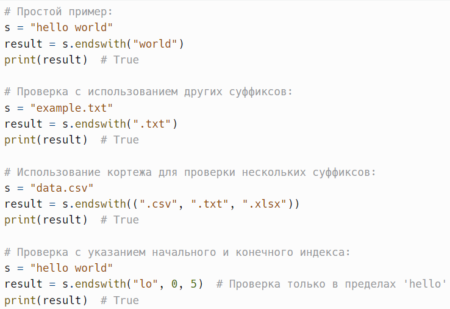
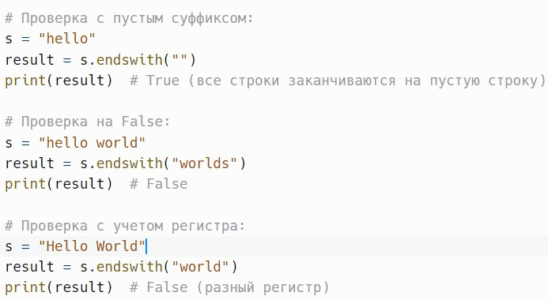
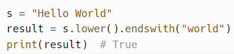
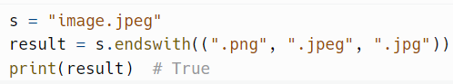
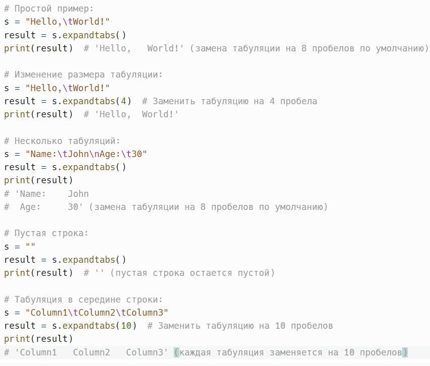
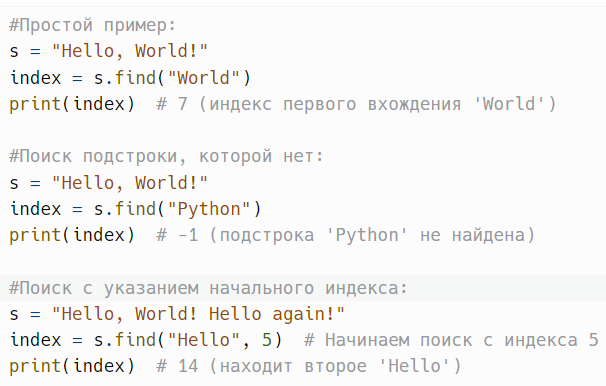
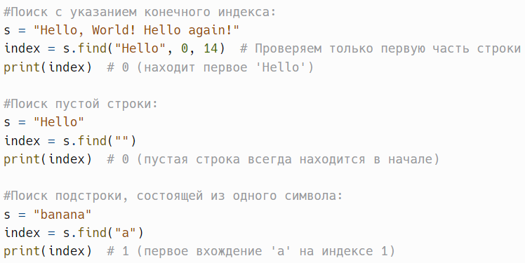
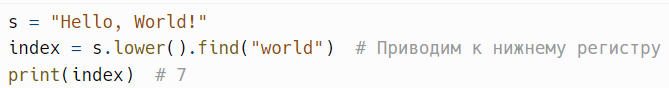
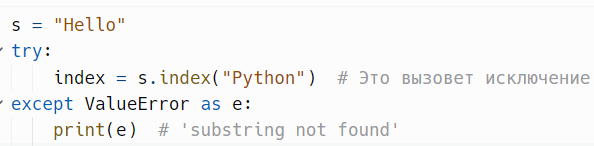
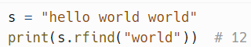

# Окончания, начало строки, табуляция и поиск

> Исходник: страницы 356–361.

<!-- Страница 356 -->

endswith(suffix, start=0, end=len(string)) - возвращает True, если строка
заканчивается указанным суффиксом.

Метод endswith() в Python — это встроенный метод строк, который
проверяет, заканчивается ли строка указанным суффиксом. Это полезный
инструмент для выполнения проверок на окончание строки и может
использоваться в различных сценариях, таких как валидация форматов
файлов, URL и других текстовых данных.

suffix: str или tuple — суффикс или кортеж суффиксов, которые
нужно проверить. Если передан кортеж, метод будет проверять,
заканчивается ли строка хотя бы одним из суффиксов в кортеже.

start: int (по умолчанию 0) — начальный индекс, с которого
начинается проверка. Это позволяет ограничить проверку частью строки.

end: int (по умолчанию длина строки) — конечный индекс, до
которого будет производиться проверка. Это также позволяет ограничить
проверку частью строки.

<!-- Страница 357 -->

Метод возвращает True, если строка заканчивается указанным
суффиксом, и False в противном случае.
Пример:

Метод endswith() учитывает регистр символов. Если вам нужно
сделать проверку без учета регистра, сначала преобразуйте строку и
суффикс к одному регистру.
Пример:

Если передан кортеж в качестве суффикса, метод вернет True, если
строка заканчивается хотя бы одним из указанных суффиксов.

<!-- Страница 358 -->

Пример:

Метод endswith() всегда возвращает True, если суффикс пустой. Это
связано с тем, что любая строка заканчивается на пустую строку.

Если передать не строку и не кортеж, будет вызвано исключение
TypeError.
startswith(suffix, start=0, end=len(string)) - возвращает True, если строка
начинается указанным суффиксом.

---

expandtabs(tabsize=8) - возвращает копию строки, где все символы
табуляции заменены пробелами.

Метод expandtabs() в Python — это встроенный метод строк, который
возвращает новую строку, где все символы табуляции (\t) заменены
пробелами. Это полезно, когда нужно выровнять текст с помощью
пробелов, вместо использования табуляции, что может быть особенно
важно для обеспечения правильного отображения текста в разных средах.

tabsize: int (по умолчанию 8) — количество пробелов, которые будут
использоваться для замены одного символа табуляции. Это значение может
быть изменено в зависимости от ваших потребностей.

Метод возвращает новую строку, в которой все символы табуляции
заменены соответствующим количеством пробелов.
Пример:

<!-- Страница 359 -->

Использование пробелов вместо табуляции может помочь
обеспечить единообразное отображение текста в разных редакторах и
средах, так как разные программы могут по-разному интерпретировать
символы табуляции.

Если ваша строка содержит как пробелы, так и табуляции, так как
метод expandtabs() заменяет только символы табуляции.

---

find(substring, start=0, end=len(string)) ~ index() - возвращает
наименьший индекс подстроки substring, если она найдена в строке.
возвращает -1, если не найдена. index возвращает же ValueError.

Метод find() в Python — это встроенный метод строк, который
используется для поиска подстроки в строке. Он возвращает наименьший
индекс первого вхождения подстроки. Если подстрока не найдена, метод
возвращает -1. Этот метод полезен для выполнения поиска и проверки
наличия определенной последовательности символов в строке.

substring: str — подстрока, которую нужно найти в строке.

<!-- Страница 360 -->

start: int (по умолчанию 0) — начальный индекс, с которого
начинается поиск. Это позволяет ограничить поиск определенной частью
строки.

end: int (по умолчанию длина строки) — конечный индекс, до
которого будет производиться поиск. Это также позволяет ограничить
поиск определенной частью строки.

Метод возвращает:
Наименьший индекс первого вхождения подстроки substring, если
она найдена.

-1, если подстрока не найдена в строке.
Пример:

Метод find() учитывает регистр символов. Если вам нужно
выполнить поиск без учета регистра, следует сначала привести строку и
подстроку к одному регистру.
Пример:

<!-- Страница 361 -->

Методы find() и index() похожи, но различаются тем, что index()
вызывает исключение ValueError, если подстрока не найдена, в то время как
find() возвращает -1.
Пример:

---

rfind(substring, start=0, end=len(string)) - возвращает наибольший индекс
подстроки substring. возвращает -1, если подстрока не найдена.
Пример:

rindex(substring, start=0, end=len(string)) - похож на rfind, но вызывает
ошибку ValueError, если подстрока не найдена.

---
