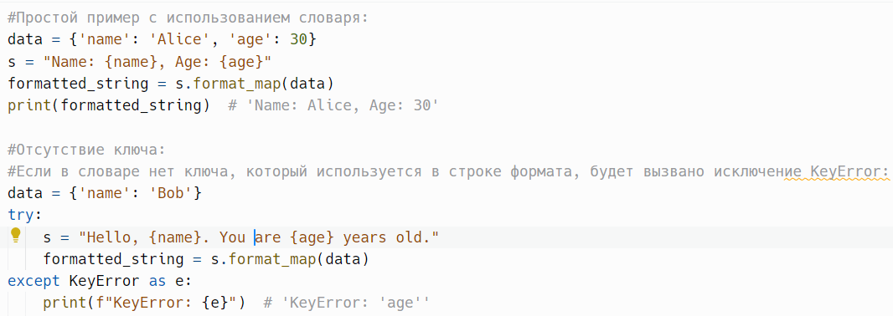
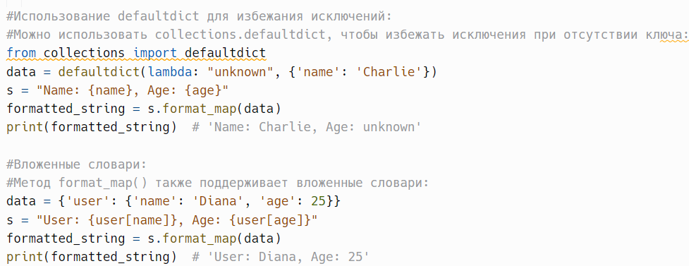
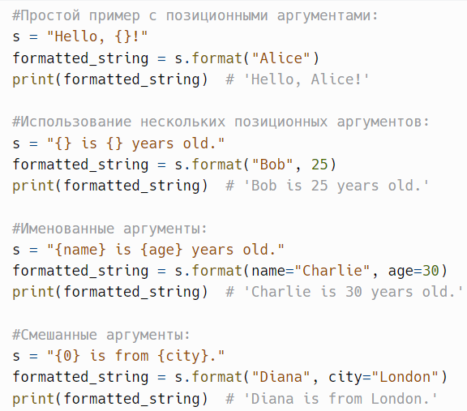
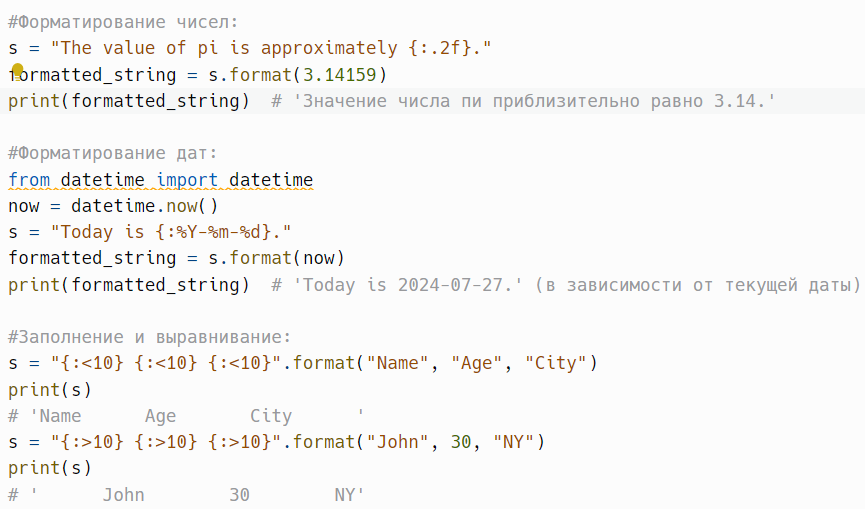
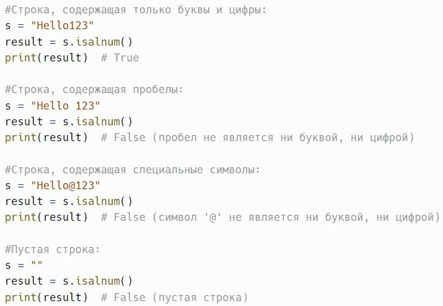
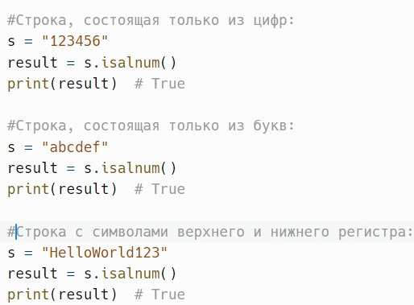

# Форматирование строк и isalnum()

> Исходник: страницы 361–365.

<!-- Страница 361 -->

format_map(mapping) - похож на format, но использует словарь для
подстановки значений.

Метод format_map() в Python — это встроенный метод строк, который
позволяет форматировать строки с использованием значений из словаря
(или любого другого объекта, который поддерживает протокол получения
элемента). Он работает аналогично методу format(), но вместо
позиционных или именованных аргументов принимает единственный
аргумент в виде словаря, что упрощает форматирование для сложных
объектов.

mapping: dict или объект, поддерживающий протокол получения
элемента — словарь, содержащий ключи, которые используются для
подстановки значений в строку.

Метод возвращает новую строку, в которую подставлены значения из
словаря на основе указанных ключей.
Пример:

<!-- Страница 362 -->

format_map() удобен, когда нужно подставить множество значений из
словаря в строку без необходимости перечисления их в явном виде.

При отсутствии ключа в словаре будет вызвано исключение KeyError,
поэтому полезно использовать структуры данных, которые позволяют
избежать этого, например, defaultdict.

format_map() может работать с вложенными структурами, что делает
его мощным инструментом для форматирования сложных строк.

В некоторых случаях format_map() может быть более
производительным, чем format(), особенно при использовании большого
количества замен.

---

format(*args, **kwargs) -
форматирует строку, используя
позиционные и именованные аргументы.

Метод format() в Python — это мощный встроенный метод строк,
который используется для форматирования текста. Он позволяет вставлять
значения в строку, используя как позиционные, так и именованные
аргументы.

*args: Позиционные аргументы — значения, которые будут
подставлены в строку в порядке их указания.

<!-- Страница 363 -->

**kwargs: Именованные аргументы — пары ключ-значение, где
ключи соответствуют заполнителям в строке формата.

Метод возвращает новую строку, в которую подставлены значения из
аргументов.
Пример:

Заполнители в строке могут быть обозначены фигурными скобками
{}. Если вы хотите вставить саму фигурную скобку в строку, используйте
двойные фигурные скобки: {{ или }}.

Если вы не укажете номера в фигурных скобках, Python будет
использовать порядок, в котором вы передали аргументы.

<!-- Страница 364 -->

Вы можете указать форматирование для каждого заполнителя,
например, число с определенным количеством знаков после запятой.

Если вы часто форматируете строки в цикле, использование метода
format() может быть менее эффективным, чем использование f-строк
(форматированных строковых литералов) в Python 3.6 и выше.

---

isalnum() - возвращает True, если строка состоит только из
алфавитных символов и чисел и не пустая.

Метод isalnum() в Python — это встроенный метод строк, который
проверяет, состоит ли строка только из алфавитных символов (букв) и цифр
(чисел). Он также проверяет, что строка не является пустой. Этот метод
полезен для валидации входных данных и проверки формата строк.

Метод возвращает:
True, если строка состоит только из алфавитных символов и цифр и не
является пустой.

False в противном случае (если строка пустая или содержит другие
символы, такие как пробелы, знаки препинания и специальные символы).
Пример:

<!-- Страница 365 -->

Если строка содержит пробелы, знаки препинания или специальные
символы, метод вернет False.

Метод корректно работает с Unicode-символами. Например, строка,
содержащая китайские иероглифы, будет проверяться на наличие букв и
цифр, а не только латинских символов.

---
