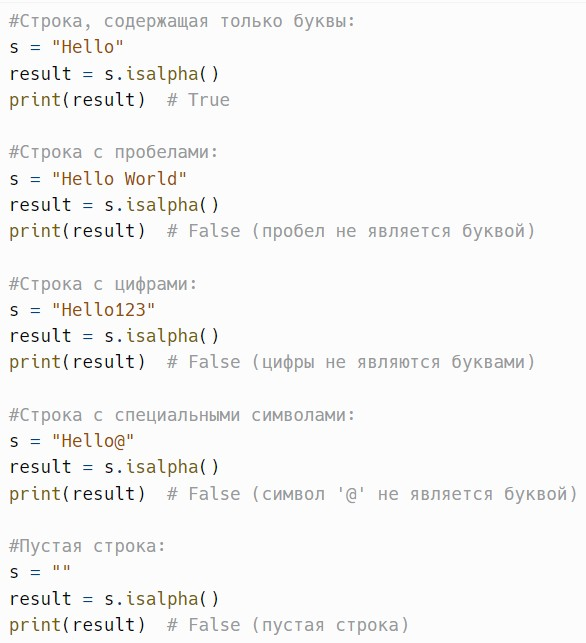
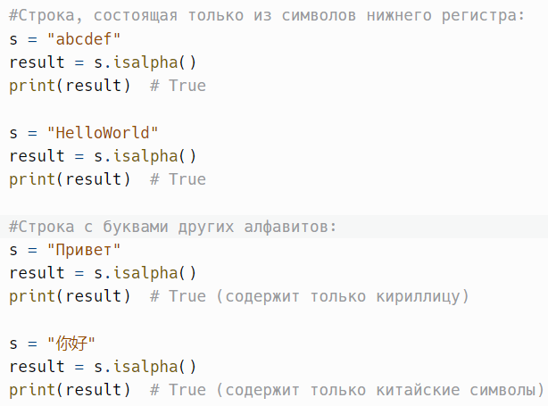
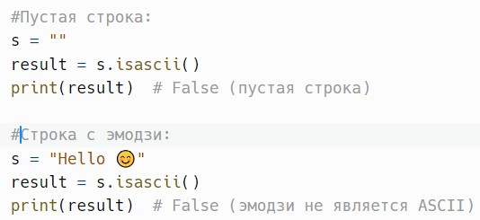
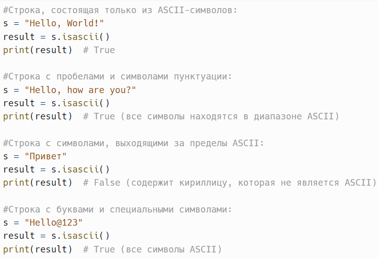
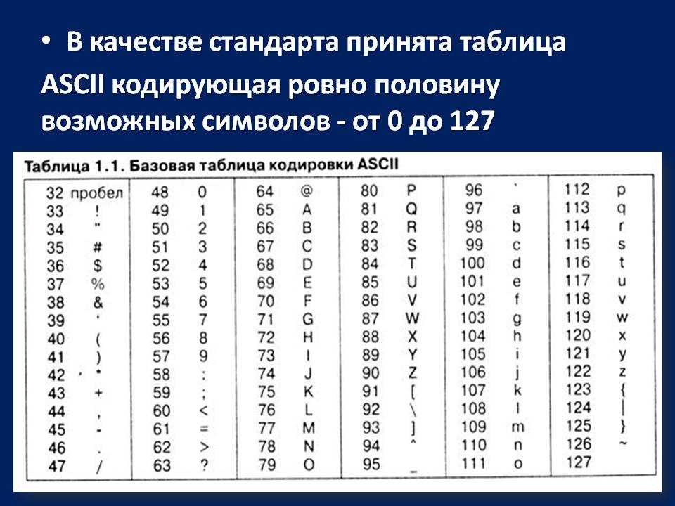
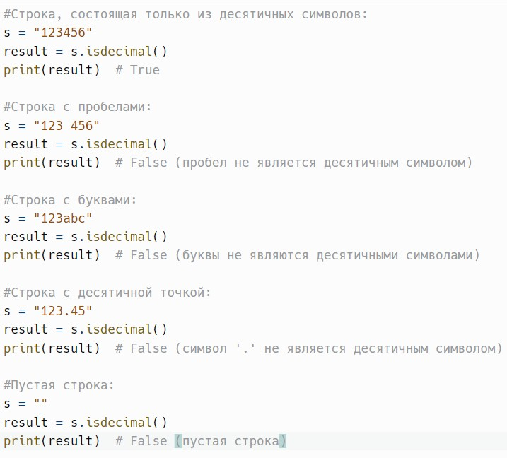
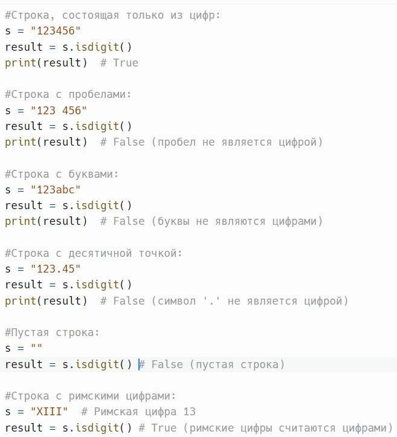
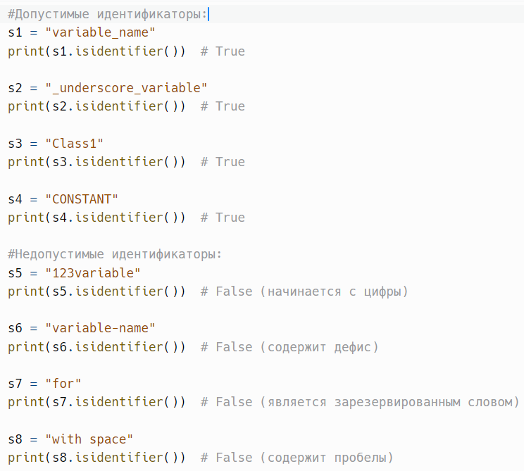
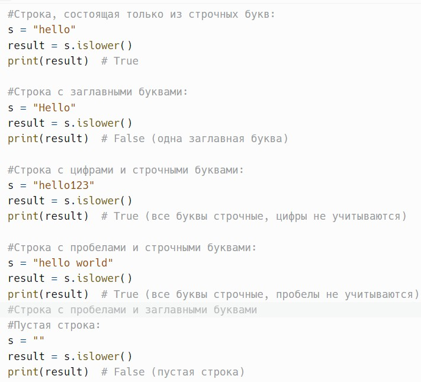
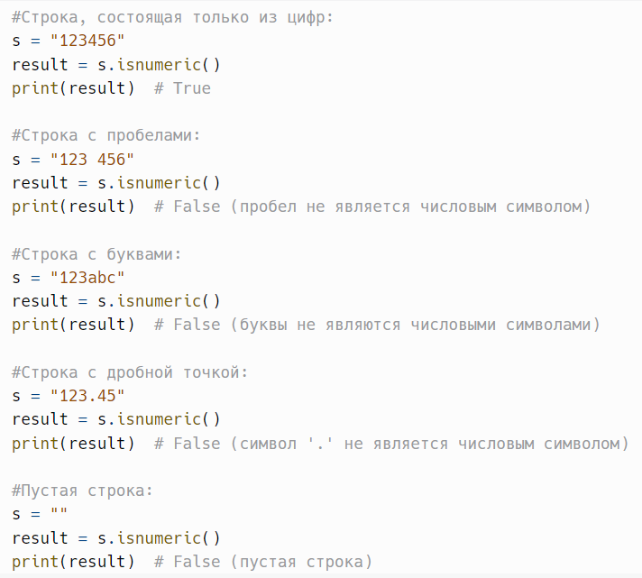

# Проверка содержимого строк: isalpha(), isascii(), isdecimal(), isdigit(), isidentifier(), islower(), isnumeric()

> Исходник: страницы 365–373.

<!-- Страница 365 -->

isalpha() - возвращает True, если строка состоит только из алфавитных
символов и не пустая.

Метод isalpha() в Python — это встроенный метод строк, который
проверяет, состоит ли строка только из алфавитных символов. Он также
гарантирует, что строка не является пустой. Этот метод полезен для
валидации входных данных, когда необходимо удостовериться, что строка
содержит только буквы.

Метод возвращает:
True, если строка состоит только из алфавитных символов и не
является пустой.

False в противном случае (если строка пустая или содержит символы,
которые не являются буквами, такие как цифры, пробелы или специальные
символы).
Пример:

<!-- Страница 366 -->

Метод isalpha() поддерживает не только латинские буквы, но и буквы
из других алфавитов, таких как кириллица, арабский, греческий и т.д. Это
делает его универсальным для различных языков.

---

isascii() - возвращает True, если строка состоит только из ASCII-
символов.

Метод isascii() в Python — это встроенный метод строк, который
проверяет, состоит ли строка только из ASCII-символов. Этот метод был

<!-- Страница 367 -->

добавлен в Python 3.7 и позволяет быстро определить, содержит ли строка
символы, которые входят в стандартный набор ASCII, т.е. символы с
кодами от 0 до 127.
Метод возвращает:

True, если строка состоит только из ASCII-символов и не является
пустой.

False в противном случае (если строка содержит хотя бы один символ
с кодом больше 127 или является пустой).
Пример:

Метод полезен в ситуациях, когда необходимо обеспечить
совместимость с системами, которые поддерживают только ASCII-
символы, например, некоторые сетевые протоколы или старые базы
данных.

<!-- Страница 368 -->

---

isdecimal() - возвращает True, если строка состоит только из
десятичных символов и не пустая.

Метод isdecimal() в Python — это встроенный метод строк, который
проверяет, состоит ли строка только из десятичных символов. Десятичные
символы — это цифры, которые используются для записи чисел в
десятичной системе счисления, включая только символы от '0' до '9'. Этот
метод гарантирует, что строка не является пустой и что каждый символ в
строке является десятичным.

Метод возвращает:
True, если строка состоит только из десятичных символов и не
является пустой.

False в противном случае (если строка пустая или содержит символы,
которые не являются десятичными).
Пример:

<!-- Страница 369 -->

Метод isdecimal() является более строгим, чем методы isdigit() и
isnumeric(). Например, isdigit() возвращает True для символов, которые
могут не быть десятичными в обычном смысле (например, римские
цифры), а isnumeric() также может возвращать True для некоторых других
типов символов, таких как дробные числа.

---

isdigit() - возвращает True, если строка состоит только из цифр и не
пустая.

Метод isdigit() в Python — это встроенный метод строк, который
проверяет, состоит ли строка только из цифр. Это значит, что метод
возвращает True, если все символы в строке являются цифрами, и строка не
является пустой. В отличие от метода isdecimal(), который проверяет
только десятичные символы (от 0 до 9), метод isdigit() также может
распознавать цифры в других системах счисления, такие как римские
цифры.
Метод возвращает:

True, если строка состоит только из цифр и не является пустой.
False в противном случае (если строка пустая или содержит символы,
которые не являются цифрами).
Пример:

<!-- Страница 370 -->

Метод isdigit() полезен для проверки, что строка содержит только
цифры. Например, его можно использовать при валидации ввода, когда
необходимо убедиться, что пользователь вводит только числовые значения.

---

isidentifier() - возвращает True, если строка является допустимым
идентификатором в Python.

Метод isidentifier() в Python — это встроенный метод строк, который
проверяет, является ли строка допустимым идентификатором в языке
Python. Допустимый идентификатор в Python должен следовать
определенным правилам:

1. Начинаться с буквы (a-z, A-Z) или символа подчеркивания _.
2. Могут содержать далее буквы, цифры (0-9) или символ

подчеркивания _.
Идентификаторы в Python не могут начинаться с цифры и не могут
содержать пробелы или специальные символы.

Метод возвращает:
True, если строка является допустимым идентификатором в Python.
False в противном случае.

<!-- Страница 371 -->

Пример:

Некоторые слова, такие как False, None, True, and, or, if, else, и другие,
являются зарезервированными словами и не могут быть использованы в
качестве идентификаторов.

---

islower() - возвращает True, если все буквенные символы в строке
являются строчными и есть хотя бы одна буква.

Метод islower() в Python — это встроенный метод строк, который
проверяет, являются ли все буквенные символы в строке строчными
(маленькими) и присутствует ли хотя бы одна буква. Если строка содержит
буквы, которые все являются строчными, и не пустая, метод возвращает
True. В противном случае он возвращает False.

Метод возвращает:
True, если все буквенные символы в строке строчные и есть хотя бы
одна буква.

False в противном случае (если строка пустая или если хотя бы одна
буква в строке является заглавной).
Пример:

<!-- Страница 372 -->

---

isnumeric() - возвращает True, если строка состоит только из
числовых символов и не пустая.

Метод isnumeric() в Python — это встроенный метод строк, который
проверяет, состоит ли строка только из числовых символов. Этот метод
возвращает True, если все символы в строке являются числовыми, и строка
не является пустой. В отличие от методов isdigit() и isdecimal(), метод
isnumeric() может распознавать и другие формы чисел, такие как дробные
числа и числа в других системах счисления.

Метод возвращает:
True, если строка состоит только из числовых символов и не является
пустой.

False в противном случае (если строка пустая или содержит символы,
которые не являются числовыми).
Пример:

<!-- Страница 373 -->

---
