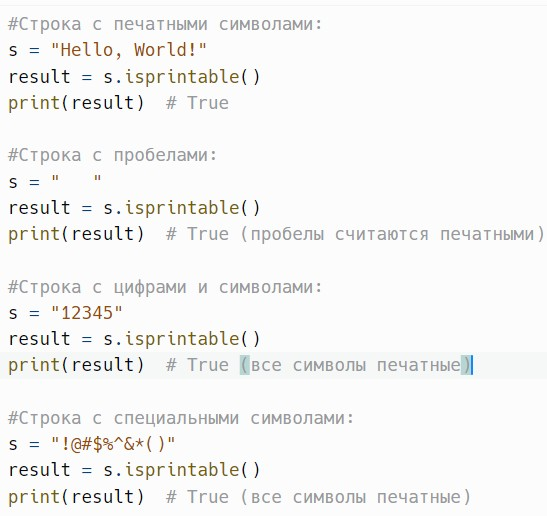
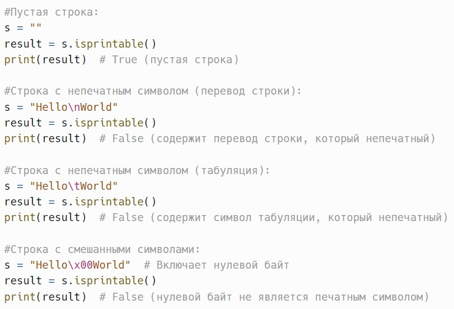
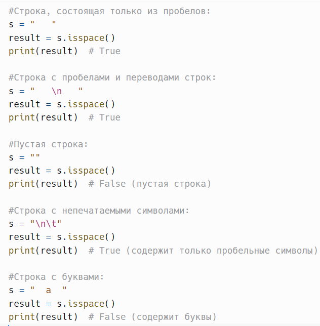
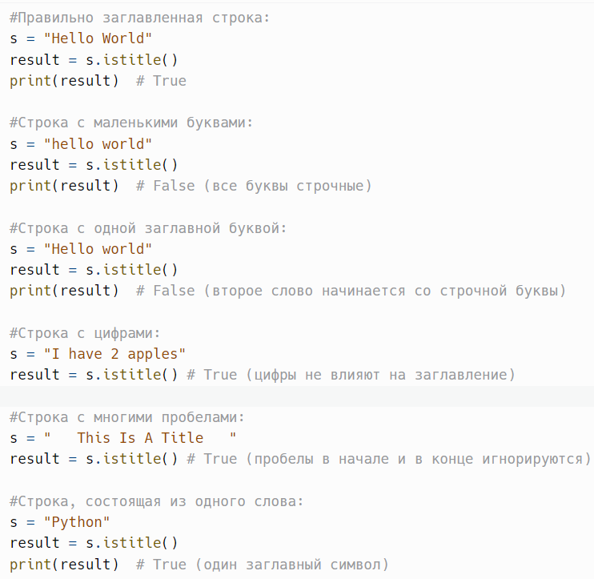
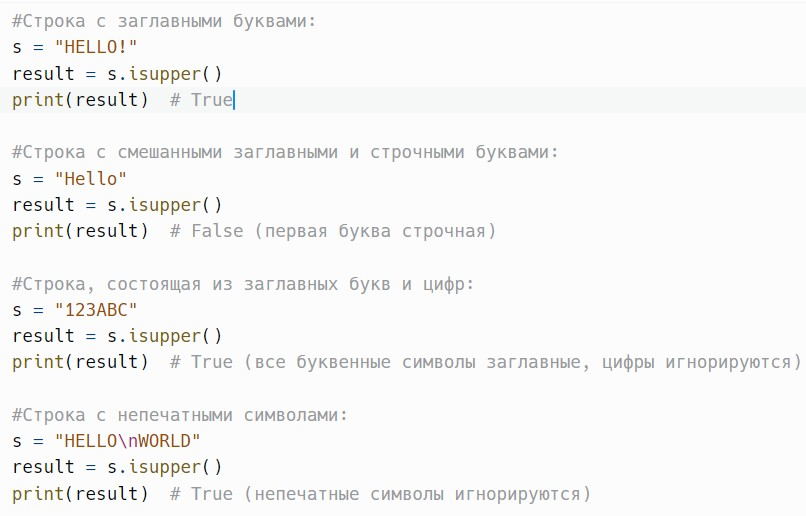
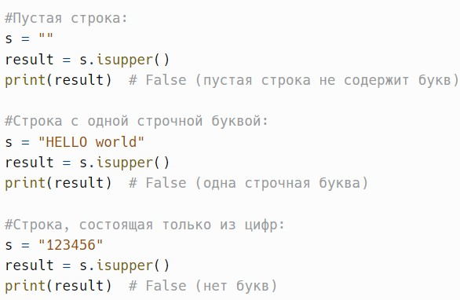

# Печатность, пробелы и регистр: isprintable(), isspace(), istitle(), isupper()

> Исходник: страницы 373–377.

<!-- Страница 373 -->

isprintable() - возвращает True, если все символы в строке являются
печатными или строка пустая.

Метод isprintable() в Python — это встроенный метод строк, который
проверяет, состоит ли строка только из печатных символов или является
пустой. Печатные символы включают в себя буквы, цифры, пробелы и
специальные символы, которые могут быть отображены на экране.
Символы, такие как перевод строки (\n), табуляция (\t) и другие непечатные
символы, не считаются печатными.

Метод возвращает:
True, если все символы в строке являются печатными или если строка
пустая.

False в противном случае (если строка содержит хотя бы один
непечатный символ).
Пример:

<!-- Страница 374 -->

---

isspace() - возвращает True, если строка состоит только из
пробельных символов и не пустая.

Метод isspace() в Python — это встроенный метод строк, который
проверяет, состоит ли строка только из пробельных символов и не является
пустой. Пробельные символы включают в себя пробелы, табуляции (\t),
переводы строки (\n), возвраты каретки (\r), и другие пробельные символы,
определенные в Unicode.

Метод возвращает:
True, если строка состоит только из пробельных символов и не
является пустой.

<!-- Страница 375 -->

False в противном случае (если строка пустая или содержит хотя бы
один непробельный символ).
Пример:

Метод isspace() проверяет наличие любых пробельных символов. Это
означает, что строка может содержать комбинацию пробелов, табуляций и
переводов строк и всё равно будет считаться пробельной, если не содержит
других символов.

---

istitle() - возвращает True, если строка заглавлена правильно, то есть
первая буква каждого слова заглавная, остальные строчные.

Метод istitle() в Python — это встроенный метод строк, который
проверяет, правильно ли заглавлена строка. Строка считается заглавленной
(или в титульном регистре), если первая буква каждого слова является
заглавной, а все остальные буквы в слове — строчными. Метод возвращает
True, если строка соответствует этому критерию, и False в противном
случае.

Метод возвращает:
True, если строка заглавлена правильно.

<!-- Страница 376 -->

False в противном случае (если хотя бы одно слово не начинается с
заглавной буквы или содержит заглавные буквы в других позициях).
Пример:

Метод istitle() считает слово любым фрагментом текста, отделённым
пробелами. Поэтому он корректно работает с предложениями,
содержащими запятые, точки и другие знаки препинания.

---

isupper() - возвращает True, если все буквенные символы в строке
являются заглавными и есть хотя бы одна буква.

Метод isupper() в Python — это встроенный метод строк, который
проверяет, состоят ли все буквенные символы в строке из заглавных букв и
есть ли хотя бы одна буква. Если строка соответствует этим критериям,
метод возвращает True; в противном случае он возвращает False.

Метод возвращает:
True, если все буквенные символы в строке являются заглавными и
присутствует хотя бы одна буква.

<!-- Страница 377 -->

False в противном случае (если строка пустая или если есть хотя бы
одна строчная буква).
Пример:

Метод isupper() учитывает регистр букв, поэтому строки,
содержащие хотя бы одну строчную букву, будут возвращать False.

Метод игнорирует все не буквенные символы (цифры, пробелы и
специальные символы) при проверке, поэтому их наличие не влияет на
результат, если в строке есть хотя бы одна буква.

---
