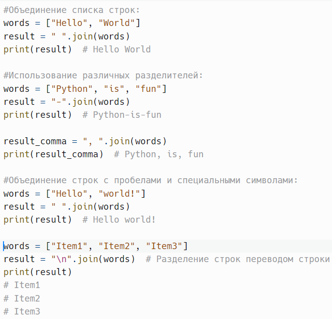
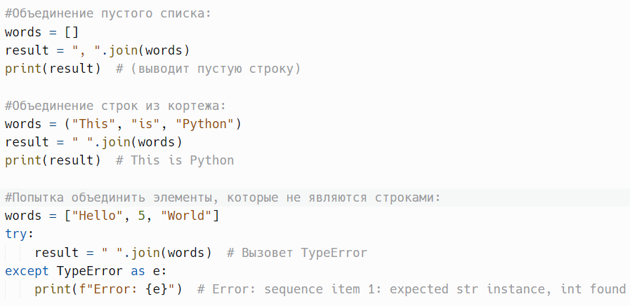
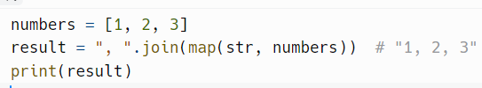
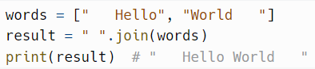
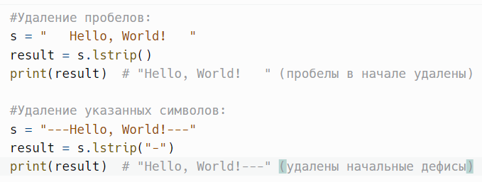
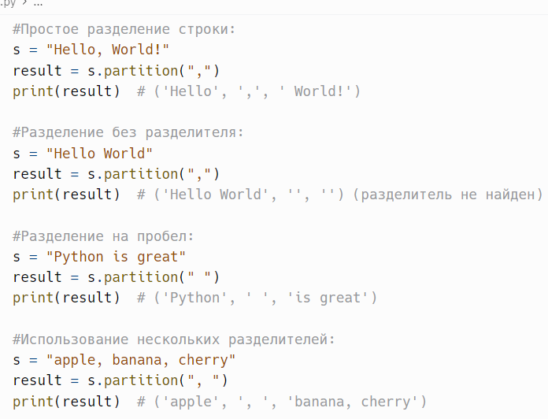
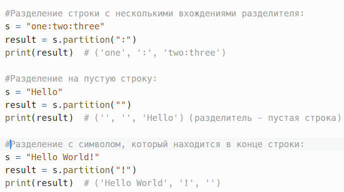
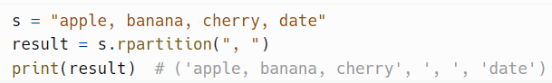

# Объединение, очистка и partition()

> Исходник: страницы 378–382.

<!-- Страница 378 -->

join(iterable) - возвращает строку, состоящую из элементов итерации,
разделенных строкой.

Метод join() в Python — это встроенный метод строк, который
объединяет элементы из итерабельного объекта (например, списка, кортежа
или множества) в одну строку. Метод использует строку, на которой он был
вызван, в качестве разделителя между элементами.

iterable: Обязательный параметр. Итерабельный объект (например,
список, кортеж или множество), элементы которого будут объединены в
строку. Все элементы должны быть строками, иначе вызов метода вызовет
ошибку TypeError.

Метод возвращает новую строку, состоящую из объединенных
элементов итерации, разделенных строкой, на которой был вызван метод.
Пример:

<!-- Страница 379 -->

Все элементы, передаваемые в join(), должны быть строками. Если вы
попытаетесь объединить элементы, содержащие типы данных, отличные от
строк (например, числа), будет вызвано исключение TypeError.

Чтобы избежать этого, вы можете преобразовать элементы в строки с
помощью функции map():
Пример:

Использование join() предпочтительнее для объединения большого
количества строк, чем конкатенация с помощью оператора +, так как метод
join() создает только одну новую строку, тогда как + создает временные
строки на каждом шаге конкатенации.

Вы можете использовать любой разделитель: пробел, запятую,
символы, строки и т.д.

Пробелы в начале или в конце строки будут игнорироваться.
Пример:

---

lstrip(chars=None) - возвращает копию строки с удаленными
начальными символами (по умолчанию пробелами).

Метод lstrip() в Python используется для удаления начальных
символов из строки. Этот метод возвращает новую строку, из которой

<!-- Страница 380 -->

удалены все указанные символы (или пробелы, если символы не указаны) с
начала строки.

chars: Необязательный параметр. Строка, содержащая символы,
которые должны быть удалены с начала строки. Если параметр не указан,
будут удалены все пробельные символы (такие как пробелы, табуляция и
переводы строки).

Метод возвращает новую строку с удаленными начальными
символами. Если в строке не было символов для удаления, возвращается
оригинальная строка.
Пример:

---

rstrip(chars=None) - возвращает копию строки с удаленными
конечными символами (по умолчанию пробелами)

strip(chars=None) - возвращает копию строки с удаленными
начальными и конечными символами (по умолчанию пробелами).

---

partition(sep) - разделяет строку на три части: до разделителя, сам
разделитель и после разделителя. если разделитель не найден, возвращает
кортеж с самой строкой и двумя пустыми строками.

Метод partition() в Python используется для разделения строки на три
части: часть перед указанным разделителем, сам разделитель и часть после
него. Это позволяет легко извлекать подстроки из строки, особенно если
вам нужно получить информацию о том, где именно разделяется строка.

sep: Обязательный параметр. Строка-разделитель, по которой будет
производиться разделение.
Метод возвращает кортеж из трёх элементов:

1. Часть строки до разделителя.
2. Сам разделитель.
3. Часть строки после разделителя.

<!-- Страница 381 -->

Если разделитель не найден, возвращается кортеж, состоящий из
самой строки и двух пустых строк.
Пример:

Метод partition() ищет только первое вхождение разделителя. Если
вы хотите разделить строку на основе всех вхождений разделителя, вы
можете использовать метод split(), который возвращает список всех
подстрок.

Если указанный разделитель не найден в строке, возвращается
кортеж, содержащий оригинальную строку и две пустые строки. Это может

<!-- Страница 382 -->

быть полезно для обработки ошибок или проверки наличия разделителя без
необходимости дополнительного кода.

Возвращаемое значение является кортежем, а не списком. Это
означает, что его элементы нельзя изменять, но вы можете легко
обращаться к ним по индексам.

Как и большинство методов строк в Python, partition() не изменяет
оригинальную строку, а возвращает новый кортеж.

---

rpartition(sep) - похож на partition, но ищет разделитель с конца строки.
Пример:

---
