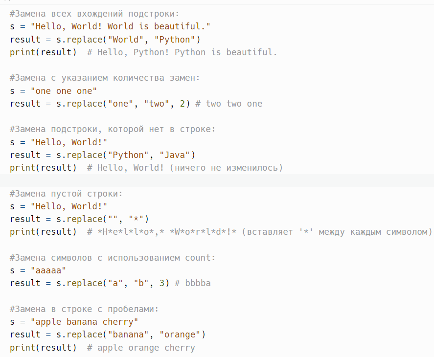
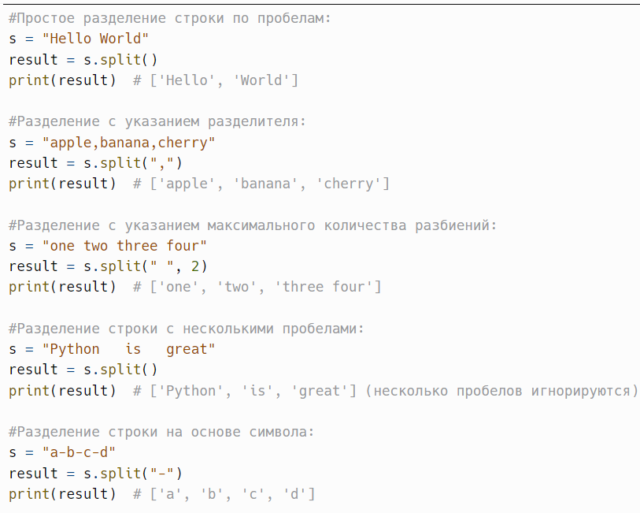
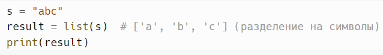
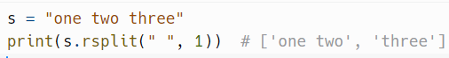
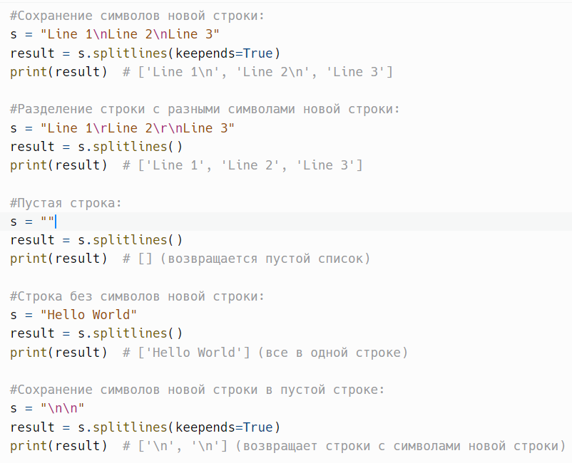
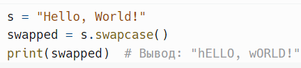
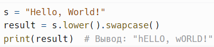
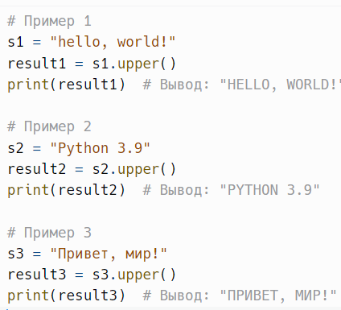
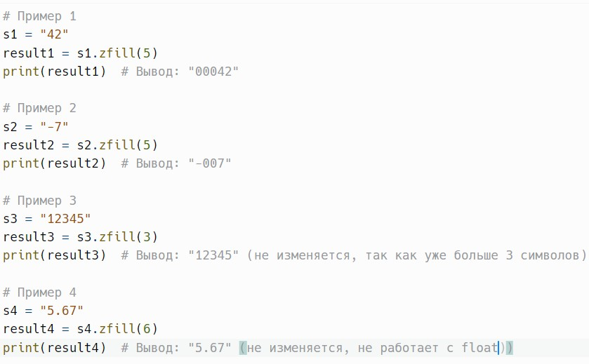
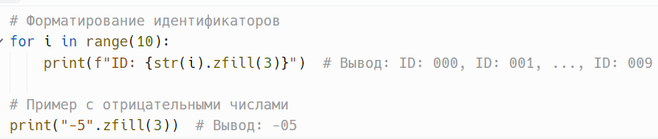

# Замена, разбиение и преобразование строк

> Исходник: страницы 382–388.

<!-- Страница 382 -->

replace(old, new, count=-1) - возвращает копию строки, где все
вхождения подстроки old заменены на new. если задано, заменяет не более
count вхождений.

Метод replace() в Python используется для замены всех (или
определенного количества) вхождений подстроки в строке на другую
подстроку. Это позволяет легко изменять текст, заменяя определённые
слова или символы на новые.

old: Подстрока, которую нужно заменить.
new: Подстрока, на которую будет заменена old.
count: Необязательный параметр. Указывает, сколько вхождений old
следует заменить. По умолчанию значение -1, что означает замену всех
вхождений.

Метод возвращает новую строку с заменёнными подстроками.
Оригинальная строка не изменяется, так как строки в Python неизменяемы.
Пример:

<!-- Страница 383 -->

Метод replace() чувствителен к регистру. Это означает, что замена
"hello" и "Hello" будет производиться отдельно.

Если count не указан или задан как -1, метод заменит все вхождения.
Это позволяет легко управлять количеством замен.

Заменять подстроки с помощью replace() обычно более эффективно,
чем вручную перебирая строку и заменяя символы, особенно если
количество замен велико.

---

split(sep=None, maxsplit=-1) - разделяет строку на список подстрок,
используя указанный разделитель. если разделитель не указан, разделяет по
пробелам.

Метод split() в Python используется для разделения строки на список
подстрок, используя указанный разделитель. Если разделитель не указан,
строка разделяется по пробелам, включая любые пробельные символы
(пробелы, табуляцию и переводы строки).

sep: Необязательный параметр. Разделитель, по которому будет
производиться разбиение. Если не указан, используются пробелы.

<!-- Страница 384 -->

maxsplit: Необязательный параметр. Указывает максимальное
количество разбиений. По умолчанию -1, что означает, что строка будет
разбита на всевозможные подстроки.

Метод возвращает список подстрок, полученных в результате
разбиения строки. Если строка пуста, возвращается пустой список.
Пример:

Для разделения строки на символы вы можете использовать метод
list(), так как метод split() не может работать с пустой строкой как
разделителем.
Пример:

Если разделитель не указан, метод split() игнорирует лишние
пробелы и разбивает строку только по последовательностям пробельных
символов.

<!-- Страница 385 -->

Если используется строка в качестве разделителя, то она
чувствительна к регистру. Например, s.split("A") не найдёт "a".

Этот параметр позволяет контролировать количество разбиений.
Если указан, строка будет разбита не более чем на maxsplit + 1 частей.

Если строка пустая, метод возвращает пустой список. Это важно
учитывать при обработке данных.

---

rsplit(sep=None, maxsplit=-1) - похож на split, но разделяет строку с конца.
Пример:

---

splitlines(keepends=False) - возвращает копию строки в нижнем
регистре.

Метод splitlines() в Python используется для разбиения строки на
список подстрок, основываясь на символах новой строки (\n, \r, \r\n). Этот
метод особенно полезен при работе с текстовыми файлами или
многострочными строками.

keepends: Необязательный параметр. Если задано True, символы
новой строки будут сохранены в результатах. По умолчанию False, что
означает, что символы новой строки не будут включены в возвращаемые
строки.

Метод возвращает список строк, полученных в результате разбиения
оригинальной строки. Если строка пуста, возвращается пустой список.
Пример:

<!-- Страница 386 -->

Этот параметр позволяет пользователю контролировать, нужно ли
сохранять символы новой строки. Это может быть полезно, если
необходимо сохранить форматирование текста.

Если в строке нет символов новой строки, результат будет содержать
всю строку в одном элементе списка.

splitlines() работает быстрее и эффективнее, чем комбинация методов
split() и strip(), если требуется только разделение по строкам.

---

swapcase() - возвращает копию строки с измененными регистрами
всех букв.

Возвращает копию строки с измененными регистрами всех букв:
символы в верхнем регистре становятся символами в нижнем регистре, а
символы в нижнем регистре становятся символами в верхнем регистре.

Другие символы, такие как цифры, пробелы и знаки препинания,
остаются неизменными.
Пример:

<!-- Страница 387 -->

Как и многие другие методы строк, swapcase() может быть вызван в
цепочке с другими методами.
Пример:

---

upper() - преобразует строку в верхний регистр.
Метод upper() возвращает новую строку, в которой все буквы
преобразованы в верхний регистр.

Все символы, которые не являются буквами (например, цифры,
пробелы и знаки препинания), остаются без изменений.
Пример:

---

zfill(width) - заполняет строку слева нулями до указанной ширины.
Метод zfill(width) возвращает строку, которая является копией
оригинальной строки, дополненной нулями слева, чтобы длина новой
строки стала равной width.

Если оригинальная строка уже длиннее или равна width, она остается
без изменений.

Если строка представляет собой отрицательное число, символ минус
(-) остается на первой позиции, а нули добавляются после него.
Пример:

<!-- Страница 388 -->

Метод не предназначен для работы с числами с плавающей точкой.
Если строка содержит точку, метод будет вести себя как указано выше, но
не будет корректно обрабатывать число как десятичное.

Метод zfill() часто используется при работе с числами, когда нужно
форматировать вывод, например, при выводе номеров, идентификаторов
или в любых других случаях, когда необходим фиксированный формат.
Пример:

---
