# Аннотации типов

> Исходник: страницы 389–392.

<!-- Страница 389 -->

**Модуль 5.**

Аннотации типов в Python позволяют разработчикам указывать
ожидаемые типы аргументов и возвращаемых значений функций, а также
типов переменных. Это помогает сделать код более понятным и облегчает
его сопровождение.

Аннотации типов не влияют на выполнение программы, но служат
для улучшения документации и поддержки статической проверки типов с
помощью инструментов, таких как mypy.

Аннотации типов добавляются после имени переменной или
параметра функции с помощью двоеточия. Для указания типа
возвращаемого значения используется стрелка (->).
Пример:

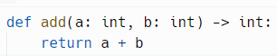

В этом примере функция add принимает два аргумента типа int и
возвращает значение типа int.

Вы можете использовать встроенные типы, такие как int, str, float,
bool, list, и другие.
Пример:

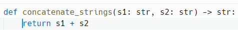

Аннотации типов не предотвращают использование динамических
типов. Вы все равно можете передавать аргументы других типов, но это
может привести к ошибкам во время выполнения.
Пример:

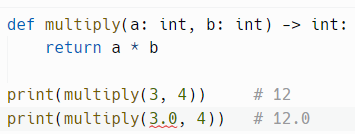

Более подробно этот процесс описан в видео. Аннотации типов.
В видео проскальзывает слово «Ошибка», но хочу подчеркнуть,
что это лишь предупреждение о том, что передаваемый тип значения
не соответствует заявленному! Функция от этого хуже работать не
станет.

В Python можно работать с аннотациями типов для коллекций без
использования модуля typing, начиная с Python 3.9. В этой версии был
введен синтаксис, который позволяет использовать встроенные типы
коллекций с помощью квадратных скобок.

<!-- Страница 390 -->

Пример использования аннотаций для коллекций до версии Python 3.9:

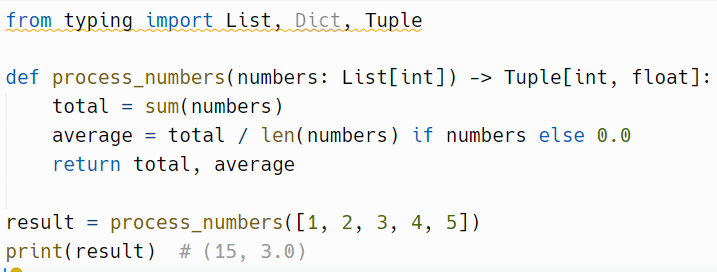

Пример использования аннотаций для коллекций при Python 3.9:

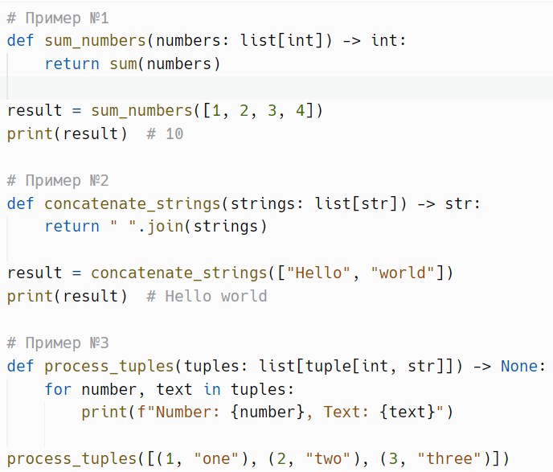

Таким образом, с Python 3.9 и выше вы можете использовать
встроенные аннотации типов для списков, не прибегая к модулю typing. Это
делает синтаксис более простым и удобочитаемым. Однако если вы
используете более старые версии Python (например, 3.8 и ниже), вам нужно
будет использовать List из typing.

В Python 3.10 вы можете использовать оператор | для указания, что
переменная может быть одного из нескольких типов, включая None. Это
позволяет более лаконично указывать типы, вместо использования Optional
и Union из typing.
Пример №1:

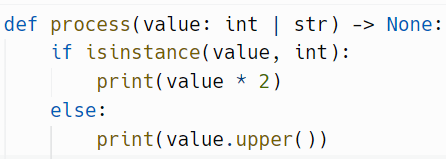

<!-- Страница 391 -->

Пример №2:

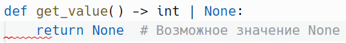

Пример №3:

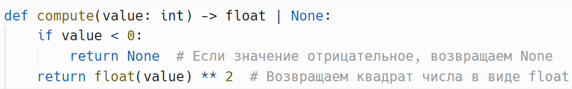

---

Вы можете аннотировать переменные в глобальной области
видимости. Это полезно для документирования типов переменных и
позволяет статическим анализаторам проверять соответствие типов.
Пример:

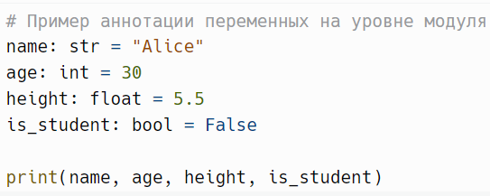

Вы также можете использовать аннотации внутри функций для
указания типов локальных переменных.
Пример:

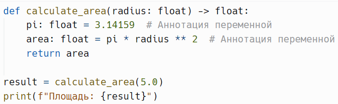

Для получения аннотаций переменных можно использовать
специальный атрибут __annotations__, который возвращает словарь с
именами переменных в качестве ключей и их типами в качестве значений.
Пример №1:

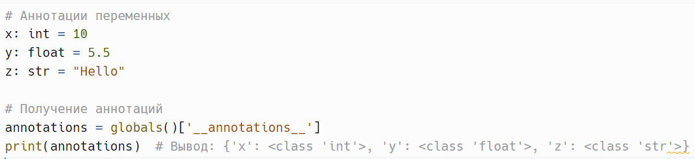

Пример №2:

<!-- Страница 392 -->

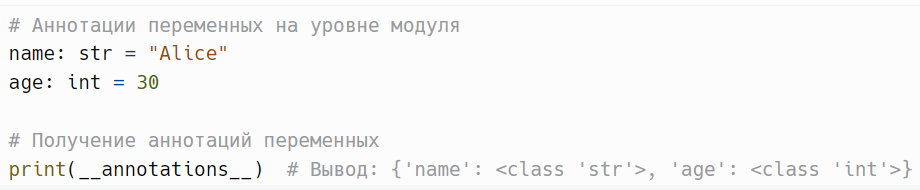

Пример №3:

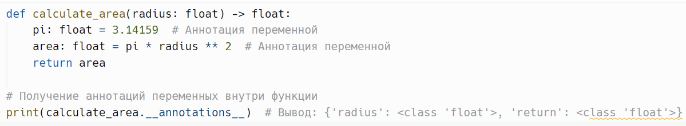

Атрибут __annotations__ работает в различных контекстах:
1. На уровне модуля.
2. В параметрах и возвращаемых значениях функций.
3. В локальных переменных функций.
4. В классах и их атрибутах.
5. В экземплярах классов.
