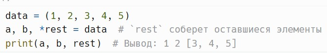
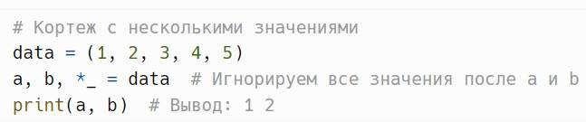
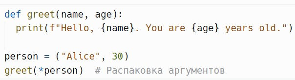
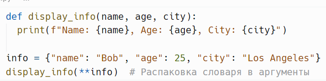
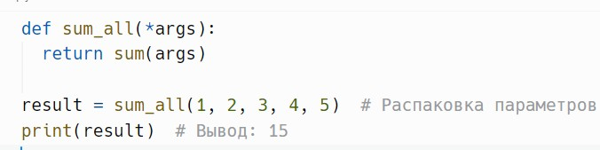

# Распаковка

> Исходник: страницы 396.

<!-- Страница 396 -->

Распаковка — это процесс извлечения значений из коллекций
(например, списков, кортежей) и присваивания их переменным.
Пример:

Здесь переменные a и b принимают первые два значения, а rest
собирает оставшиеся в список.

Кроме того, Вы можете игнорировать определенные значения,
используя _.
Пример:

Также можно распаковывать аргументы при вызове функции.
Пример:

Распаковка словарей в функции с использованием **.
Пример:

Распаковка параметров в функции с использованием *args.
Пример:

Распаковка значений в зависимости от их количества.
Пример:
